# **keyestudio Self-balancing Car Kit**

## Overview

How to DIY a mini balance car on your own? This balance car kit is based on
Arduino development platform. We mainly use Keyestudio REV4 (Black) Main Control
Board as core and balance shield with built-in MPU-6050 as drive board to test
the car body posture.

The balance shield comes with a Bluetooth interface, fully compatible with the
Bluetooth XBee module (only compatible with Android system).

When connecting to Bluetooth, you can easily control the moving direction of
balance car with Bluetooth APP, making a variety of unique postures.  
To facilitate the operation control, Bluetooth APP has both key and gravity
control modes.

Moreover, it adds the function of adjusting the balance angle and PID parameters
as well, so you can perfectly adjust and control the balance car.  
No need to worry how to play it. We can provide you with all assembly
components, as well as the corresponding installation, debugging method and
program.

## Operation Principle

The self-balancing car uses the power of the car body to maintain the relative
balance, which is a process of dynamic balance.

The power to maintain the balance of the car comes from the movement of the
wheels, driven by two DC motors.

The control of the car body can be divided into three control tasks as follows:

**1. Balance Control:** keep the car upright and balanced by controlling the
forward and backward rotation of the car’s wheel.

**2. Speed Control:** realize the front and rear movement and speed control by
controlling the inclination of the car. In fact, it is achieved finally by
controlling the speed of the motor.

**3. Direction Control:** realize the steering control by controlling the
rotational speed differences between the two motors of the car.

In this way, it is relatively simple to understand the three control tasks.

But in the final control process, it comes down to the control of a control
quantity. So there will be coupling between the three tasks, which will
interfere with each other.

The key is to control the car’s balance; the speed and direction control should
be as smooth as possible.

## Parameters of balance car

1.  **Motor parameters:**

| \*\*\*\*Operating voltage: DC12V |
|----------------------------------|
| Reduction ratio: 1:30            |
| No-load current: ≤100mA          |
| No-load speed: 247rpm            |
| Rated torque: 1.4 Kg.cm          |
| Rated torque: 137.3mN.m          |
| Rated speed: 160rpm              |
| Rated current: ≤0.45A            |
| Stalled torque: 5.5 Kg.cm        |
| Stop current: 2.4A               |
| Reducer length: 22mm             |

1.  **Working voltage: DC 9-12V**

2.  **Motor drive chip: TB6612FNG**

3.  **Body posture detection: MPU-6050**

4.  **Comes with power control switch**

5.  **Comes with Bluetooth control switch for controlling serial communication**

**Pay special attention to:**

The balance shield comes with a slide switch for controlling the Bluetooth
communication.

When upload the source code, must turn the slide switch OFF; otherwise, code
uploading will fail.

When connecting to the Bluetooth module, should turn the slide switch ON.

## Kit List

The kit packaging contains all electronic components for this self-balancing
car. As you work your way through each project, you will learn how to control
the car.

| **No.** | **Component**                                                                 | **Quantity** | **Picture**                                     |
|---------|-------------------------------------------------------------------------------|--------------|-------------------------------------------------|
| 1       | Dual-pass M3\*45MM hex copper pillar                                          | 4            |  |
| 2       | Dual-pass M3\*10MM hex copper pillar                                          | 4            |  |
| 3       | Black M4\*6 cross screw                                                       | 2            |  |
| 4       | M3\*6MM round head screw                                                      | 6            |  |
| 5       | M3\*8MM round head screw                                                      | 10           |  |
| 6       | M3\*8MM flat head cross screw                                                 | 4            |  |
| 7       | M3\*12MM flat head cross screw                                                | 2            |  |
| 8       | M3\*12MM round head screw                                                     | 10           |  |
| 9       | M3 nickel plating nut                                                         | 12           |  |
| 10      | Acrylic plate pack of 2pcs                                                    | 1            |  |
| 11      | Black+blue outer diameter 68mm thickness 26mm wheel                           | 2            |  |
| 12      | GM37-520 DC gear motor with hall encoder 12V，1：30，with type L holders      | 2            |  |
| 13      | 6MM hole\*18MM length Copper hex coupler                                      | 2            |  |
| 14      | Double-head 6pin PH2.0 30CM connector wire                                    | 2            | 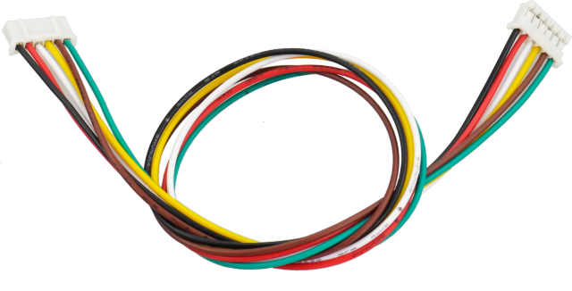 |
| 15      | Yellow-black handle 3\*40MM Phillips screwdriver                              | 1            |  |
| 16      | Type L M2 nickel plating inner hex wrench                                     | 1            |  |
| 17      | 18650 3-cell AA battery case with 15CM lead+plug (18650 battery not included) | 1            |  |
| 18      | Keyestudio Balance Shield V3 (black and eco-friendly)                         | 1            |  |
| 19      | Keyestudio REV4 (Black) Main Control Board                                    | 1            |  |
| 20      | AM/BM transparent blue OD:5.0 L=50cm USB cable                                | 1            |  |
| 21      | Keyestudio Bluetooth XBee HC-06                                               | 1            |  |
| 22      | Motor iron holder                                                             | 1            |  |
| 23      | Black winding tube                                                            | 1            |  |

## Assembly Steps

**⑴** Prepare all the components shown below.

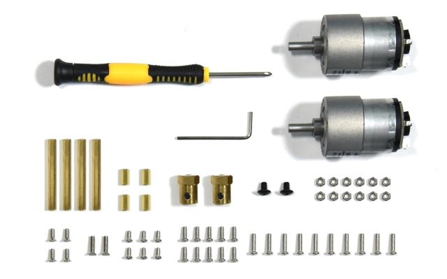

**⑵** To begin with, we start to install the bottom Acrylic plate.

Find out the parts below:

-   Bottom Acrylic plate

-   Dual-pass M3\*10MM hex copper pillar x 4pcs

-   M3\*8MM screw x 4pcs

-   M3\*12MM flat head screw x 2pcs

-   M3 nickel plating nut x 2pcs

-   Battery case

We are now going to mount the battery case and copper pillars on the Acrylic
plate.

Fix the 4pcs M3\*10MM copper pillar onto the Acrylic plate using 4pcs M3\*8MM
screws.

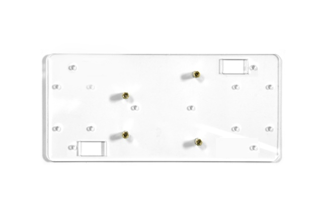

Then Mount the battery case on the Acrylic plate using 2pcs M3\*12MM flat head
screws and 2pcs M3 nickel plating Nuts.

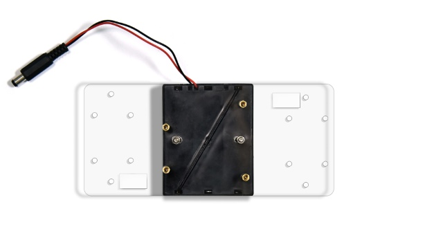

**⑶** Next, move on to install the motor and wheel onto bottom Acrylic plate.

Find out the parts below:

-   Bottom Acrylic plate mounted with battery case

-   M3\*12MM round-head screw x 8pcs

-   M3 nickel plating nut x 8pcs

-   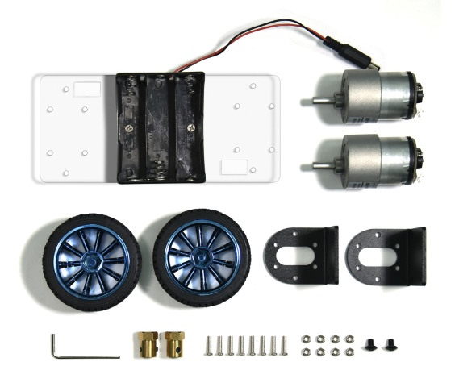M4\*6MM black screw x 2pcs

-   Two wheels

-   Two black connectors

-   Two motors

-   Two copper hex couplers

-   M2 wrench Type L

Go to mount the two black connectors onto the Acrylic plate using 8pcs M3\*12MM
round-head screws and 8pcs M3 nickel plating nuts. Shown below.

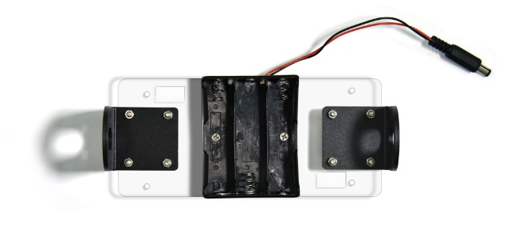

Each motor is equipped with six screws in the bag. Go to mount the two motors on
the black connectors using the screws.

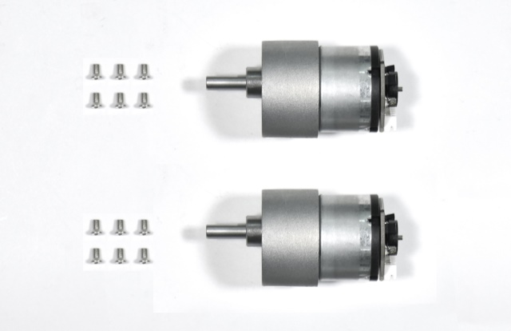

Screw each copper hex couplers with two screws. Then fix the two copper couplers
on the two motors using a wrench.

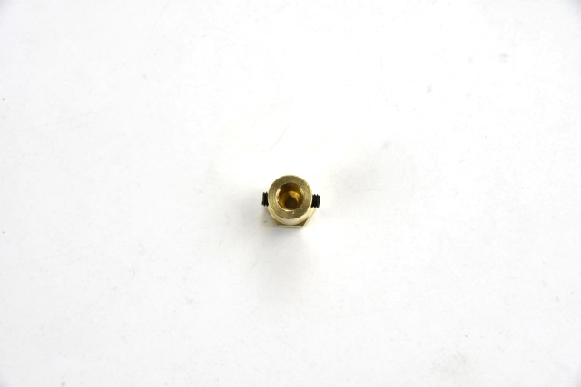

Finally mount the two wheels to the two hex copper couplers using 2pcs M4\*6MM
black screws.

Up to now, the bottom motor wheel are installed well!

**⑷** The final step is to install the control board and the top Acrylic plate.

****

-   Top Acrylic plate

-   REV4 control board

-   keyestudio balance shield

-   Bluetooth XBee module HC-06

-   M3\*6MM round-head screw x 3pcs

-   M3\*45MM copper pillar x 4pcs

-   M3\*8MM round-head screw x 8pcs

-   6pin 30CM connector wire x 2pcs

Go to screw the REV4 control board onto the 4pcs M3\*10MM copper pillars mounted
on the Acrylic plate with 3pcs M3\*6MM round-head screws.

Then stack the keyestudio balance shield onto REV4 control board. And plug the
Bluetooth XBee module HC-06 into the balance shield.

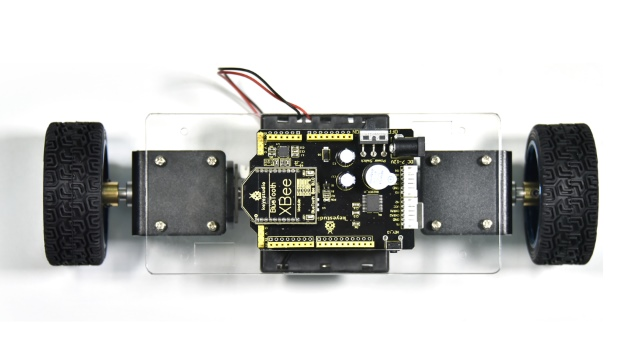

Go to connect the motor to the balance shield using 6pin PH2.0 30CM connector
wire. Simply connect the motor to the nearest motor connector.

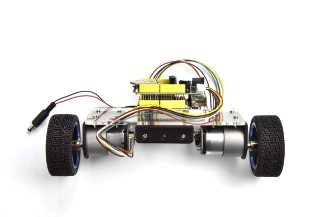

After that, screw the 4pcs M3\*45MM copper pillars on the Acrylic plate with
4pcs M3\*8MM round head screws. And connect well the battery plug to DC black
jack of REV4.

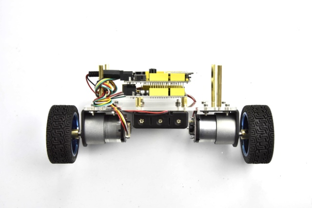

The back view is showed below:

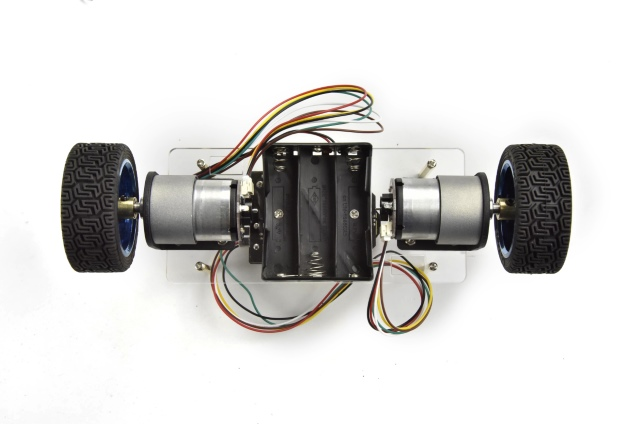

The final part is to install the top Acrylic plate onto the 4pcs M3\*45MM copper
pillars with 4pcs M3\*8MM round-head screws.

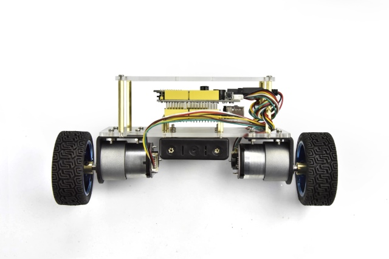

Congrats! The balance car is installed well.

Project 1: Getting Started with Main Board and ARDUINO

#### The REV4 Control Board

When it comes to using the REV4 as core of our robot, the REV4 is the best board
to get started with electronics and coding. If this is your first experience
tinkering with the platform, the REV4 is the most robust board you can start
playing with.

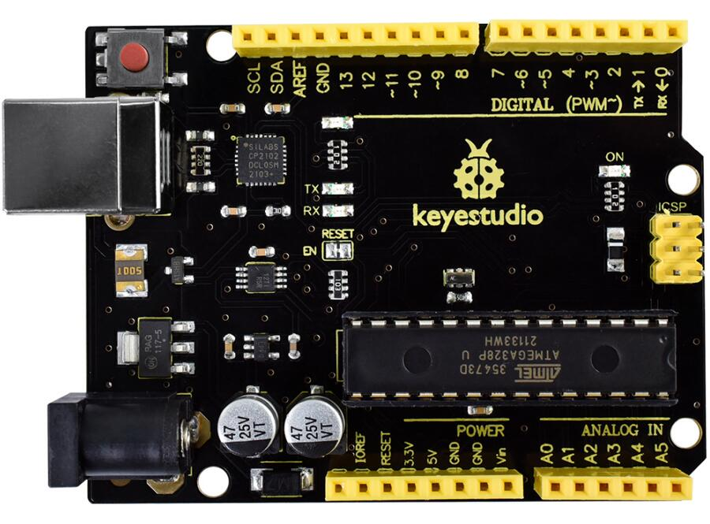

Well, let's at first have a look at this REV4 board.

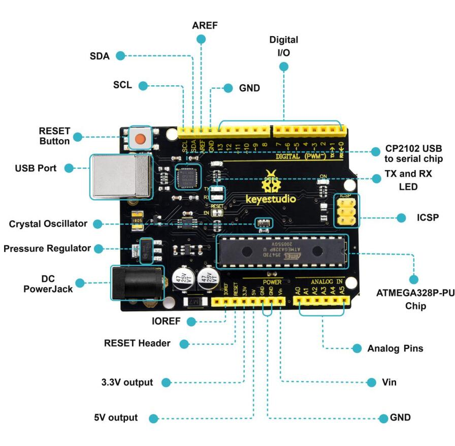

|  | **ICSP (In-Circuit Serial Programming) Header** In most case, ICSP is the AVR, an Arduino micro-program header consisting of MOSI, MISO, SCK, RESET, VCC, and GND. It is often called the SPI (serial peripheral interface) and can be considered an "extension" of the output. In fact, slave the output devices under the SPI bus host. When connecting to PC, program the firmware to ATMEGA328P-PU.                        |
|-------------------------------------------------|--------------------------------------------------------------------------------------------------------------------------------------------------------------------------------------------------------------------------------------------------------------------------------------------------------------------------------------------------------------------------------------------------------------------------------|
|  | **Power LED Indicator** Powering the Arduino, LED on means that your circuit board is correctly powered on. If LED is off, connection is wrong.                                                                                                                                                                                                                                                                                |
|  | **Digital I/O** Keyestudio REV4 (Black) Main Control Board has 14 digital input/output pins (of which 6 can be used as PWM outputs). These pins can be configured as digital input pin to read the logic value (0 or 1). Or used as digital output pin to drive different modules like LED, relay, etc. The pin labeled “〜” can be used to generate PWM.                                                                      |
|  | **GND ( Ground pin headers)** Used for circuit ground                                                                                                                                                                                                                                                                                                                                                                          |
|  | **AREF** Reference voltage (0-5V) for analog inputs. Used with [analogReference()](https://www.arduino.cc/reference/en/language/functions/analog-io/analogreference/).                                                                                                                                                                                                                                                         |
|  | **SDA** IIC communication pin                                                                                                                                                                                                                                                                                                                                                                                                  |
|  | **SCL** IIC communication pin                                                                                                                                                                                                                                                                                                                                                                                                  |
|  | **ICSP (In-Circuit Serial Programming) Header** In most case, ICSP is the AVR, an Arduino micro-program header consisting of MOSI, MISO, SCK, RESET, VCC, and GND. Connected to ATMEGA 16U2-MU. When connecting to PC, program the firmware to ATMEGA 16U2-MU.                                                                                                                                                                 |
|  | **RESET Button** You can reset your Keyestudio REV4 (Black) Main Control Board, for example, start the program from the initial status. You can use the RESET button.                                                                                                                                                                                                                                                          |
|  | **D13 LED** There is a built-in LED driven by digital pin 13. When the pin is HIGH value, the LED is on, when the pin is LOW, it's off.                                                                                                                                                                                                                                                                                        |
|  | **USB Connection** Keyestudio REV4 (Black) Main Control Board can be powered via USB connector. All you needed to do is connecting the USB port to PC using a USB cable.                                                                                                                                                                                                                                                       |
|  | **ATMEGA 16U2-MU** USB to serial chip, can convert the USB signal into serial port signal.                                                                                                                                                                                                                                                                                                                                     |
|  | **TX LED** Onboard you can find the label: TX (transmit) When Keyestudio REV4 (Black) Main Control Board communicates via serial port, send the message, TX led flashes.                                                                                                                                                                                                                                                       |
|  | **RX LED** Onboard you can find the label: RX(receive ) When Keyestudio REV4 (Black) Main Control Board communicates via serial port, receive the message, RX led flashes.                                                                                                                                                                                                                                                     |
|  | **Crystal Oscillator** How does Arduino calculate time? by using a crystal oscillator. The number printed on the top of the Arduino crystal is 16.000H9H. It tells us that the frequency is 16,000,000 Hertz or 16MHz.                                                                                                                                                                                                         |
|  | **Voltage Regulator** Convert an external input DC7-12V voltage into DC 5V, then switch DC 5V to the processor and other components. Output DC 5V, the drive current is 2A.                                                                                                                                                                                                                                                    |
|  | **DC Power Jack** Keyestudio REV4 (Black) Main Control Board can be supplied with an external power DC7-12V from the DC power jack.                                                                                                                                                                                                                                                                                            |
|  | **IOREF** Used to configure the operating voltage of microcontrollers. Use it less.                                                                                                                                                                                                                                                                                                                                            |
|  | **RESET Header** Connect an external button to reset the board. The function is the same as reset button (labeled 9)                                                                                                                                                                                                                                                                                                           |
|  | **Power Pin 3V3** A 3.3 volt supply generated by the on-board regulator. Maximum current draw is 50 mA.                                                                                                                                                                                                                                                                                                                        |
|  | **Power Pin 5V** Provides 5V output voltage                                                                                                                                                                                                                                                                                                                                                                                    |
|  | **Vin** You can supply an external power input DC7-12V through this pin to Keyestudio REV4 (Black) Main Control Board.                                                                                                                                                                                                                                                                                                         |
|  | **Analog Pins** Keyestudio REV4 (Black) Main Control Board has 6 analog inputs, labeled A0 through A5. These pins can read the signal from analog sensors (such as humidity sensor or temperature sensor), and convert it into the digital value that can read by microcontrollers) Can also used as digital pins, A0=D14, A1=D15, A2=D16, A3=D17, A4=D18, A5=D19.                                                             |
|  | **Microcontroller** Each Keyestudio REV4 (Black) Main Control Board has its own microcontroller. You can regard it as the brain of your board. The main IC (integrated circuit) on the Arduino is slightly different from the panel pair. Microcontrollers are usually from ATMEL. Before you load a new program on the Arduino IDE, you must know what IC is on your board. This information can be checked at the top of IC. |
 

#### The Balance Car Shield

The balance shield is an important part for this balance car. With it, you can
DIY the balance car more simple.

It is fully compatible with REV4 board; just stack it onto the control board.

The balance shield comes with a 6612FNG chip for driving two DC motors; two
white connectors for connecting DC motor; a DC power jack for powering on the
shield and REV4;

Also comes with a large slide switch for controlling the power switch; a
MPU-6050 for testing the posture; a XBEE Bluetooth interface for connecting
Bluetooth module to communicate with Android devices; a small slide switch for
controlling Bluetooth module’s communication; also comes with a button and an
active buzzer.

The control pins of REV4 are all brought out as female header on the shield; the
serial port and I2C communication pins are brought out as pin headers.

**Note:** connect the motor to the motor’s connector on the shield.

**PINOUT:**

#### Installing Arduino IDE

When you get the REV4 development board, first you should install the software
and driver of Arduino.

You can see all the Arduino software versions from the link below:  
[https://www.arduino.cc/en/Main/OldSoftwareReleases\##1.5.x](https://www.arduino.cc/en/Main/OldSoftwareReleases##1.5.x)

Or you can browse the ARDUINO website at this link, <https://www.arduino.cc>,
pop up the following interface.

Then click the SOFTWARE on the browse bar, you will have two options ONLINE
TOOLS and DOWNLOADS.

Click DOWNLOADS, it will appear the latest software version of ARDUINO 1.8.5
shown as below.

In this software page, on the right side you can see the version of development
software for different operating systems. So ARDUINO has a rather powerful
compatibility. You should download the software that is compatible with the
operating system of your computer.

In our project, we will take WINDOWS system as an example here. There are also
two options under Windows system, one is installed version, the other is
non-installed version.

For simple installed version, first click Windows Installer, you will get the
following page.

This way you just need to click JUST DOWNLOAD, then click the downloaded file to
install it.

For non-installed version, first click Windows ZIP file, you will also get the
pop-up interface as the above figure.

Click JUST DOWNLOAD, and when the ZIP file is downloaded well to your computer,
you can directly unzip the file and then click the icon of ARDUINO program to
start it.

#### Installing Arduino (Windows)

Install Arduino with the exe. Installation package.

Click “I Agree” to see the following interface.

Click “Next”. Pop up the interface below.

You can press Browse… to choose an installation path or directly type in the
directory you want. Then click “Install” to initiate installation.

Wait for the installing process, if appear the interface of Window Security,
just continue to click Install to finish the installation.

All right, up to now, you have completed the Arduino setup! The following icon
will appear on your PC desktop.

Double-click the icon of Arduino to enter the desired development environment
below.

#### Installing Driver

Next, we will introduce the driver installation of REV4 development board. The
driver installation may have slight differences in different computer systems.
So in the following let’s move on to the driver installation in the WIN 7
system.

The Arduino folder contains both the Arduino program itself and the drivers that
allow the Arduino to be connected to your computer by a USB cable. Before we
launch the Arduino software, you are going to install the USB drivers.

Plug one end of your USB cable into the Arduino and the other into a USB socket
on your computer.

When you connect REV4 board to your computer at the first time, right click the
icon of your “Computer” —\>for “Properties”—\> click the “Device manager”, under
“Other Devices”, you should see an icon for “Unknown device” with a little
yellow warning triangle next to it.

This is your Arduino.

Then right-click on the device and select the top menu option (Update Driver
Software...) shown as the figure below.

It will then be prompted to either “Search Automatically for updated driver
software” or “Browse my computer for driver software”. Shown as below. In this
page, select “Browse my computer for driver software”.

After that, select the option to browse and navigate to the “drivers” folder of
Arduino installation.

Click “Next” and you may get a security warning, if so, allow the software to be
installed. Shown as below.

Once the software has been installed, you will get a confirmation message.
Installation completed, click “Close”.

Up to now, the driver is installed well. Then you can right click “Computer”
—\>“Properties”—\>“Device manager”, you should see the device as the figure
shown below.

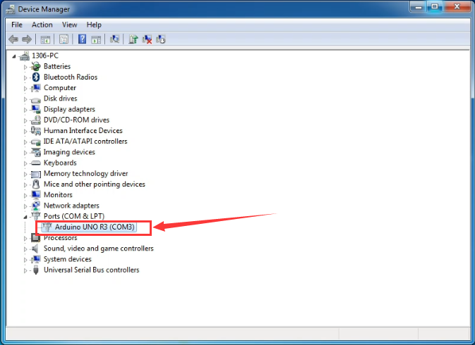

**Example Use of Arduino IDE**

**STEP 1: Open Arduino**

In the previous, we have introduced the driver installation of REV4 development
board.

This time let’s first have basic understanding of the development environment of
ARDUINO. After that, you will learn how to upload the program to Arduino board.

First of all, open the unzipped folder of ARDUINO development software and click
icon of ARDUINO to open the software, as the figure shown below.

**STEP 2: Build Projects**

When open the Arduino software, you will have two options as below:

-   Build a new project

-   Open an exiting project example

If you want to build a new project, please select “File”→then click “New”, you
will see the software interface as follows.

If you want to open an example project, please select
**File→Example→Basics→Blink**.

**STEP 3: Select Arduino Board**

On the Arduino software, you should click Tools→Board , select the correct
board. Here in our tutorial we should select Arduino Uno.

****

**STEP 4: Select Serial Port**

If you are not sure which port is correct, at first directly open the Control
Panel of your computer, then click to open Device Manager, you can check the COM
port here.

Then you should click Tools→Serial Port. It may be COM3 or higher.

**STEP 5: Upload the Code to Your Board**

Before showing you how to upload the code to your board, you can check the
function of each icon on the Tool bar of Arduino IDE listed below:

| **** **Verify/Compile** | Check the code for errors                           |
|------------------------------------------------------------------------|-----------------------------------------------------|
| **** **Upload**         | Upload the current Sketch to the Arduino            |
| **** **New**            | Create a new blank Sketch                           |
| **** **Open**           | Show a list of Sketches                             |
| **** **Save**           | Save the current Sketch                             |
| **** **Serial Monitor** | Display the serial data being sent from the Arduino |

## Project 2: Button and Buzzer

**Description:**

In the previous project, you have learned how to use Arduino software
environment.

Want to try it? Great. This project let’s get started with a basic program to
enter the programming world of arduino.

The keyestudio balance car shield comes with a button KEY_13 and an active
buzzer. To be specific, button is controlled by pin D13 on REV4; active buzzer
is controlled by pin D11 on REV4.

In the experiment, we get down to controlling the buzzer with button. When press
the button, the buzzer will sound.

\*\*\*\*The active buzzer comes
with oscillating circuit. Actually, simple to set the pin D11 to HIGH, the
buzzer can beep. We come to simulate the setting method of passive buzzer. Set
different square wave to make the active buzzer output different sounds.

**Source Code:**

const int buz = 11; // set the buzzer pin

const int btn = 13; //set the button pin

int button; //button variable

void setup()

{

pinMode(btn,INPUT); //set to INPUT state

pinMode(buz,OUTPUT); //set to OUTPUT state

}

void loop()

{

button = digitalRead(btn); //assign the button value to variable button

if(button == 0) //if press the button

{

delay(10); //delay time

if(button == 0) //judge again, if the button is pressed

{

buzzer(); // execute the subfunction of buzzer

}

}

else // button not pressed

{

digitalWrite(buz,LOW); // buzzer not sounds

}

}

//buzzer makes tick sound

void buzzer()

{

for(int i=0;i\<50;i++)

{

digitalWrite(buz,HIGH);

delay(1);

digitalWrite(buz,LOW);

delay(1);

}

delay(50);

for(int i=0;i\<50;i++)

{

digitalWrite(buz,HIGH);

delay(1);

digitalWrite(buz,LOW);

delay(1);

}

}

**Test Result**

Installed well the balance car, upload the source code and power on; turn the
slide switch ON and then press the KEY_13 button on the shield.

The active buzzer on the balance shield will sound; otherwise, it will not
sound.

## Project 3: TB6612 Motor Driving

**Description:**

We have tested the balance shield’s button and buzzer. Now, we are going to
mainly test the motor driving ability.

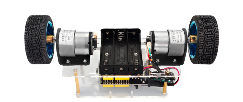In the project, we control the
right motor’s direction by pin D8 D12 on REV4; speed is controlled by pin D10.
The left motor’s direction by pin D7 D6 on REV4; speed is controlled by pin D9.

**The specified control method refers to the table below:**

| D8   | D12  | D10/PWM | Right motor | D7   | D6   | D9/PWM | Left motor |
|------|------|---------|-------------|------|------|--------|------------|
| HIGH | LOW  | 0-255   | Go front    | HIGH | LOW  | 0-255  | Go front   |
| LOW  | HIGH | 0-255   | Go back     | LOW  | HIGH | 0-255  | Go back    |
| HIGH | HIGH | /       | stop        | HIGH | HIGH | /      | stop       |
| LOW  | LOW  | /       | stop        | LOW  | LOW  | /      | stop       |

The D9 D10 are PWM pins, which can be used as Digital output or Analog output.

If used as Analog output, it needs to call the **analogWrite()** function of
ARDUINO, and this **analogWrite()** function can be controlled in the range of
0-255.

A call to analogWrite() is on a scale of 0-255, such that **analogWrite(255)**
requests a 100% duty cycle (always on), and **analogWrite(127)** is a 50% duty
cycle (on half the time).

In the code, the greater the PWM value set by pin D9 and D10, the faster the two
motors’ speed.

In the following, we only simply set the two motors to turn forward and
backward.

**Source Code:**

//TB6612 pins

const int right_R1=8;

const int right_R2=12;

const int PWM_R=10;

const int left_L1=7;

const int left_L2=6;

const int PWM_L=9;

void setup()

{

Serial.begin(9600); //set the baud rate to 9600

pinMode(right_R1,OUTPUT); // set all TB6612pins to OUTPUT

pinMode(right_R2,OUTPUT);

pinMode(PWM_R,OUTPUT);

pinMode(left_L1,OUTPUT);

pinMode(left_L2,OUTPUT);

pinMode(PWM_L,OUTPUT);

}

void loop()

{

// two motors turn forward

digitalWrite(right_R1,HIGH);

digitalWrite(right_R2,LOW);

digitalWrite(left_L1,HIGH);

digitalWrite(left_L2,LOW);

analogWrite(PWM_R,100); // write into PWM value 0\~255（speed）

analogWrite(PWM_L,100);

}

**Test Result**

Installed well the balance car, upload the source code and power on; turn the
slide switch ON.

Both left and right motors start to turn forward.

#### 

## Project 4: Hall Encoder Test

**Description:**

We have introduced how to set the speed of right and left motor by PWM value of
D9 D10.

But how to get the specified speed? Well, we can test it using the motor’s
built-in Hall encoder.

**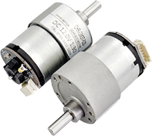**

In this project, you will learn how to calculate the specified speed by the
number of pulses got from Hall encoder within 100ms.

**Source Code:**

//TB6612 pins

const int right_R1=8;

const int right_R2=12;

const int PWM_R=10;

const int left_L1=7;

const int left_L2=6;

const int PWM_L=9;

const int PinA_left = 5; // set the left motor’s pulse pin to D5

const int PinA_right = 4; //set the right motor’s pulse pin to D4

int times=0,newtime=0,d_time=100; // time, new time, time interval

int valA=0,valB=0,flagA=0,flagB=0; //variable valA and valB for calculating the
number of pulse

void setup()

{

Serial.begin(9600);

pinMode(right_R1,OUTPUT); // set the TB6612 pins to OUTPUT

pinMode(right_R2,OUTPUT);

pinMode(PWM_R,OUTPUT);

pinMode(left_L1,OUTPUT);

pinMode(left_L2,OUTPUT);

pinMode(PWM_L,OUTPUT);

pinMode(PinA_left,INPUT); // set the pulse pin to INPUT

pinMode(PinA_right,INPUT);

}

void loop()

{

//both motors turn forward

digitalWrite(right_R1,HIGH);

digitalWrite(right_R2,LOW);

digitalWrite(left_L1,HIGH);

digitalWrite(left_L2,LOW);

analogWrite(PWM_R,100); //write into PWM value 0\~255（speed）

analogWrite(PWM_L,200);

newtime=times=millis(); //make newtime and times equal to the time the program
runs to here

while((newtime-times)\<d_time) //if less than the setting d_time，always loop

{

if(digitalRead(PinA_left)==HIGH&&flagA==0) // if detects HIGH

{

valA++; //valA plus 1

flagA=1;

}

if(digitalRead(PinA_left)==LOW&&flagA==1) // if LOW

{

valA++; //valA plus 1

flagA=0;

}

if(digitalRead(PinA_right)==HIGH&&flagB==0)

{

valB++;

flagB=1;

}

if(digitalRead(PinA_right)==LOW&&flagB==1)

{

valB++;

flagB=0;

}

newtime=millis(); //newtime equals to the time the program runs to here

}

Serial.println(valA); // print out the value of valA and B

Serial.println(valB);

valA=valB=0; //set to 0

}

**Test Result**

Installed well the balance car, upload the source code and power on; turn the
slide switch ON.

Then open the Arduino IDE, set the baud rate to 9600, the serial monitor will
pop up the number of pulse got from Hall encoder within 100ms ( correspond to
left and right motor).

See the figure below.

## Project 5: Internal Timer Interrupt

**Description:**

In previous section, you have learned how to get the number of pulses by Hall
encoder of motor within 100ms.

Now, we will use the built-in internal timer (timer2) of REV4 board. Calculate
out the specified speed by the number of pulses got from Hall encoder within
100ms.

**Source Code:**

Before test the source code, do remember to add the corresponding library.

You can refer to the method in the link below:

<https://wiki.keyestudio.com/How_to_Install_Arduino_Library>

\##include \<MsTimer2.h\>

//TB6612 pins

const int right_R1=8;

const int right_R2=12;

const int PWM_R=10;

const int left_L1=7;

const int left_L2=6;

const int PWM_L=9;

const int PinA_left = 5; //set the left motor’s pulse pin to D5

const int PinA_right = 4; //set the right motor’s pulse pin to D4

int times=0,newtime=0,d_time=100; // time, new time, time interval

int valA=0,valB=0,flagA=0,flagB=0; //variable valA and valB for calculating the
number of pulse

void setup()

{

Serial.begin(9600);

pinMode(right_R1,OUTPUT); //set the TB6612 pins to OUTPUT

pinMode(right_R2,OUTPUT);

pinMode(PWM_R,OUTPUT);

pinMode(left_L1,OUTPUT);

pinMode(left_L2,OUTPUT);

pinMode(PWM_L,OUTPUT);

pinMode(PinA_left,INPUT); // set the pulse pin to INPUT

pinMode(PinA_right,INPUT);

MsTimer2::set(100, inter); // trigger an interrupt per 100ms

MsTimer2::start(); // start interrupt

}

void loop()

{

//both motors turn forward

digitalWrite(right_R1,HIGH);

digitalWrite(right_R2,LOW);

digitalWrite(left_L1,HIGH);

digitalWrite(left_L2,LOW);

analogWrite(PWM_R,100); //write into PWM value 0\~255（speed）

analogWrite(PWM_L,200);

if(digitalRead(PinA_left)==HIGH&&flagA==0) // calculate the pulse value

{

valA++;

flagA=1;

}

if(digitalRead(PinA_left)==LOW&&flagA==1)

{

valA++;

flagA=0;

}

if(digitalRead(PinA_right)==HIGH&&flagB==0)

{

valB++;

flagB=1;

}

if(digitalRead(PinA_right)==LOW&&flagB==1)

{

valB++;

flagB=0;

}

}

//interrupt function

void inter()

{

sei(); //allow whole interrupts

Serial.print("valA = "); //print out the pulse value on serial monitor

Serial.println(valA);

Serial.print("valB = ");

Serial.println(valB);

valA = valB = 0;

}

**Test Result**

Installed well the balance car, power on and upload the source code to the
board;

Turn the slide switch ON.

Then open the monitor of Arduino IDE, set the baud rate to 9600,.

The serial monitor will pop up the number of pulse got from Hall encoder within
100ms ( correspond to left and right motor).

See the figure below.

#### 

## Project 6: Bluetooth Test

**Description:**

The kit contains a Bluetooth XBee module, which is compatible with Android
system.

Keyestudio Bluetooth XBee
wireless module HC-06 has features of compact size, compatible with XBEE shield,
and suitable for various 3.3V MCU systems. It also comes with efficient on-board
antenna.

More contents check the link here.

<https://wiki.keyestudio.com/Ks0144_keyestudio_XBee_Bluetooth_Wireless_Module_HC-06>

In this project, go to learn how to use Bluetooth APP to make the balance car
communicate with Android Bluetooth. You are able to use Bluetooth APP to
randomly control the balance car move.

**Note:**

The keyestudio balance shield comes with a slide switch for controlling the
Bluetooth communication.

When upload the source code, must turn the switch OFF; or else code uploading
fails.

When connect to the Bluetooth module, should turn the switch ON.

**How to use Bluetooth APP?**

-   Installed the balance car, upload the source code and power on; turn the
    power switch ON; turn the Bluetooth switch ON.

-   Install the Bluetooth APP, then you can see the icon below on your phone.

Click the link below to download the APP:

<https://drive.google.com/open?id=1L69xdfmOvfhg0Wjh_p2FrtRkhs1h0fEu>

-   Tap to open the Bluetooth APP; you will see the interface shown below.

-   Tap the Bluetooth icon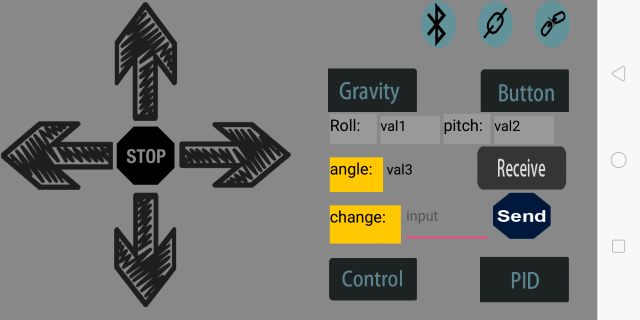; enter
    the Bluetooth search and pairing interface shown below.

-   Tap the HC-06 (search at the first time is a address, so tap the address);
    the PIN is 1234.

-   Finally you will see the paired device.

-   Connected HC-06 on your phone; now go to tap the Bluetooth connection icon
    on APP. 

-   Then tap the showed on the
    APP. Up to now, the Bluetooth should connect successfully.

-   Bluetooth connected, tap the
    key , the two motors of
    balance car turn forward;  
    tap the key, the two motors
    of balance car stop;  
    tap the key, the two motors
    of balance car turn backward.

**Source Code:**

//TB6612 pins

const int right_R1=8;

const int right_R2=12;

const int PWM_R=10;

const int left_L1=7;

const int left_L2=6;

const int PWM_L=9;

char val; // Bluetooth variable

void setup()

{

Serial.begin(9600);

pinMode(right_R1,OUTPUT); //set TB6612 pins OUTPUT

pinMode(right_R2,OUTPUT);

pinMode(PWM_R,OUTPUT);

pinMode(left_L1,OUTPUT);

pinMode(left_L2,OUTPUT);

pinMode(PWM_L,OUTPUT);

}

void loop()

{

if(Serial.available()) //if serial buffer value is available

{

val = Serial.read(); //assign the value read from serial port to val

Serial.println(val);

switch(val) //switch statement

{

case 'F': front(); break; //motor turns front

case 'B': back(); break; //turn back

case 'S': Stop();break; //stop

}

}

}

//turn front

void front()

{

digitalWrite(right_R1,HIGH);

digitalWrite(right_R2,LOW);

digitalWrite(left_L1,HIGH);

digitalWrite(left_L2,LOW);

analogWrite(PWM_R,100);

analogWrite(PWM_L,100);

}

//turn back

void back()

{

digitalWrite(right_R1,LOW);

digitalWrite(right_R2,HIGH);

digitalWrite(left_L1,LOW);

digitalWrite(left_L2,HIGH);

analogWrite(PWM_R,100);

analogWrite(PWM_L,100);

}

//stop

void Stop()

{

digitalWrite(right_R1,LOW);

digitalWrite(right_R2,HIGH);

digitalWrite(left_L1,LOW);

digitalWrite(left_L2,HIGH);

analogWrite(PWM_R,0);

analogWrite(PWM_L,0);

}

## Project 7: MPU6050 Test

**Description:**

When DIY the balance car, should obtain its posture at first. The most used is
through accelerometer and gyroscope.

In theory, only need two-axis accelerometer (Z-axis in the straight direction
and the Y-axis along the moving direction of the car) and a single-axis
gyroscope (the angular velocity in the X-axis direction of the car wheel are
calculated).

In this project, we use the built-in MPU-6050 chip of keyestudio balance shield
to test the data of the three-axis accelerometer and the three-axis gyroscope,
printing out it on the serial monitor.

The acceleration range is +-2g; the gyroscope range is +-250°/S.

**Source Code:**

\##include \<Wire.h\>

long accelX, accelY, accelZ; // set to overall variable; can be used directly
inside the function.

float gForceX, gForceY, gForceZ;

long gyroX, gyroY, gyroZ;

float rotX, rotY, rotZ;

void setup() {

Serial.begin(9600);

Wire.begin();

setupMPU();

}

void loop() {

recordAccelRegisters();

recordGyroRegisters();

printData();

delay(100);

}

void setupMPU(){

// REGISTER 0x6B/REGISTER 107:Power Management 1

Wire.beginTransmission(0b1101000); //This is the I2C address of the MPU
(b1101000/b1101001 for AC0 low/high datasheet Sec. 9.2)

Wire.write(0x6B); //Accessing the register 6B/107 - Power Management (Sec. 4.30)

Wire.write(0b00000000); //Setting SLEEP register to 0, using the internal 8 Mhz
oscillator

Wire.endTransmission();

// REGISTER 0x1b/REGISTER 27:Gyroscope Configuration

Wire.beginTransmission(0b1101000); //I2C address of the MPU

Wire.write(0x1B); //Accessing the register 1B - Gyroscope Configuration (Sec.
4.4)

Wire.write(0x00000000); //Setting the gyro to full scale +/- 250deg./s
(转化为rpm:250/360 \* 60 = 41.67rpm) ;The highest can be converted to 2000deg./s

Wire.endTransmission();

// REGISTER 0x1C/REGISTER 28:ACCELEROMETER CONFIGURATION

Wire.beginTransmission(0b1101000); //I2C address of the MPU

Wire.write(0x1C); //Accessing the register 1C - Acccelerometer Configuration
(Sec. 4.5)

Wire.write(0b00000000); //Setting the accel to +/- 2g（if choose +/- 16g，the
value would be 0b00011000）

Wire.endTransmission();

}

void recordAccelRegisters() {

// REGISTER 0x3B\~0x40/REGISTER 59\~64

Wire.beginTransmission(0b1101000); //I2C address of the MPU

Wire.write(0x3B); //Starting register for Accel Readings

Wire.endTransmission();

Wire.requestFrom(0b1101000,6); //Request Accel Registers (3B - 40)

// Use left shift \<\< and bit operations \| Wire.read() read once 1bytes，and
automatically read the data of the next address on the next call.

while(Wire.available() \< 6); // Waiting for all the 6 bytes data to be sent
from the slave machine （Must wait for all data to be stored in the buffer
before reading）

accelX = Wire.read()\<\<8\|Wire.read(); //Store first two bytes into accelX
（Automatically stored as a defined long value）

accelY = Wire.read()\<\<8\|Wire.read(); //Store middle two bytes into accelY

accelZ = Wire.read()\<\<8\|Wire.read(); //Store last two bytes into accelZ

processAccelData();

}

void processAccelData(){

gForceX = accelX / 16384.0; //float = long / float

gForceY = accelY / 16384.0;

gForceZ = accelZ / 16384.0;

}

void recordGyroRegisters()

{

// REGISTER 0x43\~0x48/REGISTER 67\~72

Wire.beginTransmission(0b1101000); //I2C address of the MPU

Wire.write(0x43); //Starting register for Gyro Readings

Wire.endTransmission();

Wire.requestFrom(0b1101000,6); //Request Gyro Registers (43 \~ 48)

while(Wire.available() \< 6);

gyroX = Wire.read()\<\<8\|Wire.read(); //Store first two bytes into accelX

gyroY = Wire.read()\<\<8\|Wire.read(); //Store middle two bytes into accelY

gyroZ = Wire.read()\<\<8\|Wire.read(); //Store last two bytes into accelZ

processGyroData();

}

void processGyroData() {

rotX = gyroX / 131.0;

rotY = gyroY / 131.0;

rotZ = gyroZ / 131.0;

}

void printData() {

Serial.print("Gyro (deg)");

Serial.print(" X=");

Serial.print(rotX);

Serial.print(" Y=");

Serial.print(rotY);

Serial.print(" Z=");

Serial.print(rotZ);

Serial.print(" Accel (g)");

Serial.print(" X=");

Serial.print(gForceX);

Serial.print(" Y=");

Serial.print(gForceY);

Serial.print(" Z=");

Serial.println(gForceZ);

}

**Test Result**

Installed well the balance car, upload the source code and power on; turn the
slide switch ON.

Then open the Arduino IDE, set the baud rate to 9600, the serial monitor will
pop up the value.

## Project 8: Calculating Inclined Angle And Angular Velocity Values

**Description:**

In the previous project, we have used accelerometer and gyroscope to get the
car’s posture.

In this lesson, we use the data measured by MPU-6050 chip to directly get the
posture of balance car.

You will learn how to calculate the tilt angle and angular velocity value
detected by balance car. Show the test result on the serial monitor.

**Source Code:**

**Note:**

Before test the source code, do remember to add the corresponding library.

You can refer to the method in the link below:

<https://wiki.keyestudio.com/How_to_Install_Arduino_Library>

\##include \<MPU6050.h\> //MPU6050 library

\##include \<Wire.h\> //IIC communication library

MPU6050 mpu6050; //Instantiate an MPU6050 object; name mpu6050

int16_t ax, ay, az, gx, gy, gz; //Define three-axis acceleration, three-axis
gyroscope variables

float Angle; //angle variable

int16_t Gyro_x; //Angular velocity variable

void setup()

{

// Join the I2C bus

Wire.begin(); //Join the I2C bus sequence

Serial.begin(9600); //open serial monitor and set the baud rate to 9600

delay(1500);

mpu6050.initialize(); //initialize MPU6050

delay(2);

}

void loop()

{

mpu6050.getMotion6(&ax, \&ay, \&az, \&gx, \&gy, \&gz); //IIC to get MPU6050
six-axis data ax ay az gx gy gz

Angle = -atan2(ay , az) \* (180/ PI); //Radial rotation angle calculation
formula; the negative sign is direction processing

Gyro_x = -gx / 131; //The X-axis angular velocity calculated by the gyroscope;
the negative sign is the direction processing

Serial.print("Angle = ");

Serial.print(Angle);

Serial.print(" Gyro_x = ");

Serial.println(Gyro_x);

}

**Test Result**

Installed well the balance car, upload the source code and power on; turn the
slide switch ON.

Then open the Arduino IDE, set the baud rate to 9600, the serial monitor will
pop up the value.

**How to use Kalman filtering to calculate the angel?**

**What’s Kalman filtering ?**

Kalman filtering is an algorithm that uses the linear system state equation to
estimate the state of the system through the input and output of the system.

Since the observed data includes the effects of noise and interference in the
system, the optimal estimate can also be seen as a filtering process.

Accelerometer data cannot always be trusted 100% due to original data acquired
by the MPU6050. **Why?**

The accelerometer measures the inertial force, which may be caused by
gravitational force (ideally only gravitational), but it may also be caused by
the acceleration (motion) of the device.

Therefore, even if the accelerometer is in a relatively stable state, it is
still very sensitive to vibration and mechanical noise.

That is, the individual number of inclination angles obtained by using the value
of the 3-axis acceleration is erroneous, and the error is large. Then you need
to use a gyroscope to eliminate any accelerometer errors.

**But how is this done? Is there no noise in the gyroscope?**

The gyroscope is not without noise, but because it measures rotation, it is less
sensitive to linear mechanical motion (the type of noise the accelerometer is
subjected to).

However, the gyroscope has other types of problems, such as drift (does not
return to zero rate values when the rotation stops).

Nonetheless, by averaging the data from the accelerometer and the gyroscope, we
can obtain a better estimate than the current device’s tilt angle obtained by
using the accelerometer data alone.

Therefore, in order to obtain a smaller, more stable angle, we need to perform
Kalman filtering on the inclination angle **θ** calculated by the acceleration
and the measured angular velocity value **θ'** of the gyroscope.

In this project，we use Kalman filter to calculate the balance angle and angular
velocity of the balance car, displaying the tested data on the serial monitor.

**Source Code:**

**Note:**

Before test the source code, do remember to add the corresponding library.

You can refer to the method in the link below:

<https://wiki.keyestudio.com/How_to_Install_Arduino_Library>

\##include \<MPU6050.h\> //MPU6050 library

\##include \<Wire.h\> //IIC communication library

MPU6050 mpu6050; //Instantiate an MPU6050 object; name mpu60500

int16_t ax, ay, az, gx, gy, gz; //Define three-axis acceleration, three-axis
gyroscope variables

float Angle;

float Gyro_x,Gyro_y,Gyro_z; //calculate angular velocity of each axis by
gyroscope

///////////////////////Kalman_Filter////////////////////////////

float Q_angle = 0.001; //Covariance of gyroscope noise

float Q_gyro = 0.003; //Covariance of gyroscope drift noise

float R_angle = 0.5; //Covariance of accelerometer

char C_0 = 1;

float dt = 0.005; //The value of dt is the filter sampling time.

float K1 = 0.05; // a function containing the Kalman gain is used to calculate
the deviation of the optimal estimate.

float K_0,K_1,t_0,t_1;

float angle_err;

float q_bias; //gyroscope drift

float accelz = 0;

float angle;

float angle_speed;

float Pdot[4] = { 0, 0, 0, 0};

float P[2][2] = {{ 1, 0 }, { 0, 1 }};

float PCt_0, PCt_1, E;

//////////////////////Kalman_Filter/////////////////////////

void setup()

{

// Join the I2C bus

Wire.begin(); //Join the I2C bus sequence

Serial.begin(9600); //open serial monitor and set the baud rate to 9600

delay(1500);

mpu6050.initialize(); //initialize MPU6050

delay(2);

}

void loop()

{

Serial.print("Angle = ");

Serial.print(Angle);

Serial.print(" K_angle = ");

Serial.println(angle);

Serial.print("Gyro_x = ");

Serial.print(Gyro_x);

Serial.print(" K_Gyro_x = ");

Serial.println(angle_speed);

mpu6050.getMotion6(&ax, \&ay, \&az, \&gx, \&gy, \&gz); //IIC to get MPU6050
six-axis ax ay az gx gy gz

angle_calculate(ax, ay, az, gx, gy, gz, dt, Q_angle, Q_gyro, R_angle, C_0, K1);
//obtain angle and KalmanFilter

}

/////////////////////////////angle calculate///////////////////////

void angle_calculate(int16_t ax,int16_t ay,int16_t az,int16_t gx,int16_t
gy,int16_t gz,float dt,float Q_angle,float Q_gyro,float R_angle,float C_0,float
K1)

{

Angle = -atan2(ay , az) \* (180/ PI); //Radial rotation angle calculation
formula; negative sign is direction processing

Gyro_x = -gx / 131; //The X-axis angular velocity calculated by the gyroscope;
the negative sign is the direction processing

Kalman_Filter(Angle, Gyro_x); //KalmanFilter

}

////////////////////////////////////////////////////////////////

///////////////////////////////KalmanFilter/////////////////////

void Kalman_Filter(double angle_m, double gyro_m)

{

angle += (gyro_m - q_bias) \* dt; //Prior estimate

angle_err = angle_m - angle;

Pdot[0] = Q_angle - P[0][1] - P[1][0]; //Differential of azimuth error
covariance

Pdot[1] = - P[1][1];

Pdot[2] = - P[1][1];

Pdot[3] = Q_gyro;

P[0][0] += Pdot[0] \* dt; //The integral of the covariance differential of the
prior estimate error

P[0][1] += Pdot[1] \* dt;

P[1][0] += Pdot[2] \* dt;

P[1][1] += Pdot[3] \* dt;

//Intermediate variable of matrix multiplication

PCt_0 = C_0 \* P[0][0];

PCt_1 = C_0 \* P[1][0];

//Denominator

E = R_angle + C_0 \* PCt_0;

//Gain value

K_0 = PCt_0 / E;

K_1 = PCt_1 / E;

t_0 = PCt_0; //Intermediate variable of matrix multiplication

t_1 = C_0 \* P[0][1];

P[0][0] -= K_0 \* t_0; //Posterior estimation error covariance

P[0][1] -= K_0 \* t_1;

P[1][0] -= K_1 \* t_0;

P[1][1] -= K_1 \* t_1;

q_bias += K_1 \* angle_err; //Posterior estimation

angle_speed = gyro_m - q_bias; //The differential value of the output value;
work out the optimal angular velocity

angle += K_0 \* angle_err; ////Posterior estimation; work out the optimal angle

}

**Test Result**

Installed well the balance car, upload the source code and power on; turn the
slide switch ON.

Then open the Arduino IDE, set the baud rate to 9600, the serial monitor will
pop up the value.

## Project 9: PID Principle

**Description:**

The **Proportion** of deviation, **Integral** and the **Differential** are
linearly combined to form a control quantity, then control object by this
control quantity. Such a controller is called a PID controller.

In analog control systems, the most common control law for controllers is PID
control.

**The block diagram of the common analog PID control system is shown below.**

The system consists of an analog PID controller and a controlled object.

In the figure, **r(t)** is a given value; **y(t)** is the actual output value of
the system;

control deviation **e(t)** equals the given value subtracts the actual output
value.

**e(t) = r(t) − y(t)**

**e(t)** is the input of the PID control; **u(t)** is used as the output of the
PID controller and the input of the controlled object.

**So the control law of the analog PID controller is follows:**

**Kp:** the proportional coefficient of the controller;

**Ti** : the integral time of the controller, also called the integral
coefficient;

**Td** : the differential time of the controller, also called the differential
coefficient.

**(1) Proportion part**

The mathematical formula of the proportional part is: **Kp×e(t)**

In the analog PID controller, the proportional link is to react to the moment of
deviation.

Once the deviation occurs, the controller immediately produces a control action
that causes the control amount to change in the direction of decreasing the
deviation.

The strength of the control depends on the proportional coefficient **Kp**.

The larger the proportional coefficient **Kp**, the stronger the control effect,
the faster the transition process, the smaller the static deviation of the
control process.

However, the larger the **Kp**, the more likely it is to oscillate and to
destroy the system stability.

Therefore, the selection of the proportional coefficient **Kp** must be
appropriate to achieve a small transition time and a small and stable static
difference.

**(2) Integral part**

The mathematical formula of the integral part is:

From the formula of the integral part, we can know that as long as there is a
deviation, its control effect will continue to increase.

Only when the deviation **e(t)=0**, its integral can be a constant, and the
control effect is not a Increased constant.

It can be seen that the integral part can eliminate the deviation of the system.

Although the adjustment function of the integral link will eliminate the static
error, it will reduce the response speed of the system and increase the
overshoot of the system.

The larger the integral constant **Ti** is, the weaker the accumulation of the
integral is. At this time, the system does not oscillate during the transition.

Increasing the integral constant **Ti** can slow down the elimination process of
the static error, and the time required to eliminate the deviation is also
longer; however, can reduce the amount of overshoot and improve the stability of
the system.

When **Ti** is small, the integral action is strong; oscillation may occur
during the system transition time, but the time required to eliminate the
deviation is short. Therefore, **Ti** must be determined according to the
specific requirements of actual control.

**(3) Differential part**

The mathematical formula of the differential part is:

In addition to the desire to eliminate static errors, the actual control system
requires an accelerated adjustment process.

At the moment when the deviation occurs, or at the moment of the deviation
change, not only the immediate response (the role of the proportional link ) is
required, but also the appropriate correction is given in advance according to
the trend of the deviation.

In order to achieve this, a differential link can be added to the PI controller
to form a PID controller.

The role of the differential link is to prevent changes in the deviation. It is
controlled according to the trend of change (speed of change).

The faster the deviation changes, the larger the output of the differential
controller, and the correction can be made before the deviation value becomes
larger.

The introduction of differential action will help to reduce the overshoot,
overcome the oscillation, and stabilize the system, especially for the
high-order system, which speeds up the tracking speed of the system.

However, the effect of differentiation is sensitive to the noise of the input
signal.

For those systems with higher noise, the differential signal is generally not
used, or the input signal is filtered before the differential action.

The effect of the differential portion is determined by the differential time
constant **Td**

The larger the **Td**, the stronger the effect of suppressing the variation of
the deviation **e(t)**;

The smaller the **Td**, the weaker the effect of its resistance to the deviation
**e(t)**.

The differential part obviously has a great effect on the stability of the
system.

By appropriately selecting the differential constant **Td**, the differential
action can be optimized.

## Project 10: Upright Loop Adjustment

**Description:**

In the previous project, we have introduced how to use MPU-6050 chip to
calculate the inclined angle and angular velocity value so as to control the
car’s balance.

In this section, we will set about to balance the car upright on a horizontal
plane via PD (**proportion** and **differential** ).

However, if placed on a slope or pushed slightly by hand, the car will
accelerate in the inclined direction and fall down.

The corresponding inclined angle value can be printed out on the serial monitor.

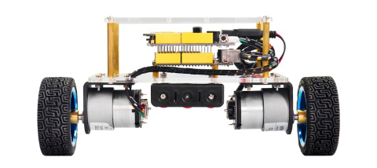

**Upright balance principle:**

The self-balancing robot stands upright on two coaxial wheels.

The gravity center of robot’s structure design is not on the axis center of the
two coaxial wheels and the air flow effect, it will fall in one direction when
standing.

To prevent the robot from falling down, it is necessary to add a suitable
opposite direction force in the falling direction.

This suitable reverse direction force is provided by a DC geared motor that
drives two wheels.

**How does a gear DC motor provide a reverse force?**

The connection between the self-balancing robot body and the wheels is
equivalent to a hinge. Figure below is a simplified diagram of a self-balancing
robot.

If the wheel accelerates to the right, due to the effect of inertia, the center
of gravity of the body will be subjected to a leftward **inertial force F**.

Just like on the car, if the car accelerates, the person on the car will lean
backwards.

**But how big is the force in the opposite direction?**

Now we come to analyze the force of the self-balancing robot body at an
**oblique angle θ**.

From the force analysis, we can get the Force balance equation below：

****

So can turn into the restoring force of robot:

From the force balance equation, the reverse direction force is determined by
the acceleration **a** of the wheel; the magnitude of the acceleration **a** is
determined by the inclination angle **θ** of the robot body.

Thus, if we know the angle of the inclination angle **θ**, and then control the
value of the acceleration **a** according to the magnitude of **θ**;

It seems that the self-balancing robot will not fall down, that is, a negative
feedback control.

However, it is difficult for the robot to stand upright and stably through
simply adjusting the acceleration **a** by the inclination angle **θ**.

Because the value of **a** is difficult to adjust to the exact value, which is
often greater than the appropriate value. So the robot tends to the other
direction, swing back and fort in the vertical position, with a larger
amplitude.

To stabilize the robot return to the vertical position as soon as possible, you
need to increase the damping force.

Supposed that the negative feedback control is that the wheel acceleration **a**
is proportional to the inclination angle **θ**, and the ratio is **k1.** That
is: 

Linearize the formula: 

because the inclination angle **θ** is relatively small, get:
 ;
 ;

The increased damping force is proportional to the speed of the declination;

The factor of proportionality is **k2**, and the direction is opposite.

Then change the formula into:

Then can get the final arithmetic of wheel acceleration **a**:

****

**θ:** inclination angle **θ':** angle speed

**K1; k2:** the factor of proportionality. It is also Kp and Kd in the PD
algorithm adjustment of the robot upright balance described later.

Up to now, in theory, the balance robot can be balanced upright.

**Source Code:**

\##include \<MsTimer2.h\> //internal timer 2

\##include \<PinChangeInt.h\> //this library can make all pins of arduino UNO as
external interrupt

\##include \<MPU6050.h\> //MPU6050 library

\##include \<Wire.h\> //IIC communication library

MPU6050 mpu6050; //Instantiate an MPU6050 object; name mpu6050

int16_t ax, ay, az, gx, gy, gz; //Instantiate an MPU6050 object; name mpu6050

//TB6612 pins

const int right_R1=8;

const int right_R2=12;

const int PWM_R=10;

const int left_L1=7;

const int left_L2=6;

const int PWM_L=9;

///////////////////////angle parameters//////////////////////////////

float Angle;

float angle_X; //calculate the inclined angle variable of X-axis by
accelerometer

float angle_Y; //calculate the inclined angle variable of Y-axis by
accelerometer

float angle0 = 1; //Actual measured angle (ideally 0 degrees)

float Gyro_x,Gyro_y,Gyro_z; //Angular angular velocity for gyroscope calculation

///////////////////////angle parameters//////////////////////////////

///////////////////////Kalman_Filter////////////////////////////

float Q_angle = 0.001; //Covariance of gyroscope noise

float Q_gyro = 0.003; //Covariance of gyroscope drift noise

float R_angle = 0.5; //Covariance of accelerometer

char C_0 = 1;

float dt = 0.005; // The value of dt is the filter sampling time.

float K1 = 0.05; // a function containing the Kalman gain is used to calculate
the deviation of the optimal estimate

float K_0,K_1,t_0,t_1;

float angle_err;

float q_bias; //gyroscope drift

float accelz = 0;

float angle;

float angleY_one;

float angle_speed;

float Pdot[4] = { 0, 0, 0, 0};

float P[2][2] = {{ 1, 0 }, { 0, 1 }};

float PCt_0, PCt_1, E;

//////////////////////Kalman_Filter/////////////////////////

//////////////////////PD parameters///////////////////////////////

double kp = 34, ki = 0, kd = 0.62; //Angle loop parameter

double setp0 = 0; //Angle balance point

int PD_pwm; //angle output

float pwm1=0,pwm2=0;

//void anglePWM();

void setup()

{

//set the control motor’s pin to OUTPUT

pinMode(right_R1,OUTPUT);

pinMode(right_R2,OUTPUT);

pinMode(left_L1,OUTPUT);

pinMode(left_L2,OUTPUT);

pinMode(PWM_R,OUTPUT);

pinMode(PWM_L,OUTPUT);

//Initial state value

digitalWrite(right_R1,1);

digitalWrite(right_R2,0);

digitalWrite(left_L1,0);

digitalWrite(left_L2,1);

analogWrite(PWM_R,0);

analogWrite(PWM_L,0);

// Join I2C bus

Wire.begin(); //Join the I2C bus sequence

Serial.begin(9600); //open serial monitor, set the baud rate to 9600

delay(1500);

mpu6050.initialize(); //initialize MPU6050

delay(2);

//5ms use timer2 to set the timer interrupt (Note: using timer2 will affect the
PWM output of pin3 pin11.)

MsTimer2::set(5, DSzhongduan); //5ms execute the function DSzhongduan once

MsTimer2::start(); // start the interrupt

}

void loop()

{

Serial.print("angle = ");

Serial.println(angle);

Serial.print("Angle = ");

Serial.println(Angle);

/\*Serial.print("Gyro_x = ");

Serial.println(Gyro_x);

Serial.print("K_Gyro_x = ");

Serial.println(angle_speed);\*/

//Serial.println(PD_pwm);

//Serial.println(pwm1);

//Serial.println(pwm2);

}

/////////////////////////////////interrupt////////////////////////////

void DSzhongduan()

{

sei(); //Allow overall interrupt

mpu6050.getMotion6(&ax, \&ay, \&az, \&gx, \&gy, \&gz); //IIC to get MPU6050
six-axis data ax ay az gx gy gz

angle_calculate(ax, ay, az, gx, gy, gz, dt, Q_angle, Q_gyro, R_angle, C_0, K1);
//get angle and Kalman_Filter

PD(); // angle loop of PD control

anglePWM();

}

///////////////////////////////////////////////////////////

/////////////////////////////angle calculation///////////////////////

void angle_calculate(int16_t ax,int16_t ay,int16_t az,int16_t gx,int16_t
gy,int16_t gz,float dt,float Q_angle,float Q_gyro,float R_angle,float C_0,float
K1)

{

Angle = -atan2(ay , az) \* (180/ PI); //Radial rotation angle calculation
formula; negative sign is direction processing

Gyro_x = -gx / 131; //The X-axis angular velocity calculated by the gyroscope;
the negative sign is the direction processing

Kalman_Filter(Angle, Gyro_x); // Kalman Filter

//Rotation Angle Z axis parameter

Gyro_z = -gz / 131; //Z-axis angular velocity

//accelz = az / 16.4;

float angleAx = -atan2(ax, az) \* (180 / PI); //Calculate the angle with the
x-axis

Gyro_y = -gy / 131.00; //Y-axis angular velocity

Yiorderfilter(angleAx, Gyro_y); //first-order filter

}

////////////////////////////////////////////////////////////////

///////////////////////////////KalmanFilter/////////////////////

void Kalman_Filter(double angle_m, double gyro_m)

{

angle += (gyro_m - q_bias) \* dt; //Prior estimate

angle_err = angle_m - angle;

Pdot[0] = Q_angle - P[0][1] - P[1][0]; //Differential of azimuth error
covariance

Pdot[1] = - P[1][1];

Pdot[2] = - P[1][1];

Pdot[3] = Q_gyro;

P[0][0] += Pdot[0] \* dt; //A priori estimation error covariance differential
integral

P[0][1] += Pdot[1] \* dt;

P[1][0] += Pdot[2] \* dt;

P[1][1] += Pdot[3] \* dt;

//Intermediate variable of matrix multiplication

PCt_0 = C_0 \* P[0][0];

PCt_1 = C_0 \* P[1][0];

//Denominator

E = R_angle + C_0 \* PCt_0;

//gain value

K_0 = PCt_0 / E;

K_1 = PCt_1 / E;

t_0 = PCt_0; //Intermediate variable of matrix multiplication

t_1 = C_0 \* P[0][1];

P[0][0] -= K_0 \* t_0; //Posterior estimation error covariance

P[0][1] -= K_0 \* t_1;

P[1][0] -= K_1 \* t_0;

P[1][1] -= K_1 \* t_1;

q_bias += K_1 \* angle_err; //Posterior estimate

angle_speed = gyro_m - q_bias; //The differential of the output value gives the
optimal angular velocity

angle += K_0 \* angle_err; ////Posterior estimation to get the optimal angle

}

/////////////////////first-order Filter/////////////////

void Yiorderfilter(float angle_m, float gyro_m)

{

angleY_one = K1 \* angle_m + (1 - K1) \* (angleY_one + gyro_m \* dt);

}

//////////////////angle PD////////////////////

void PD()

{

PD_pwm = kp \* (angle + angle0) + kd \* angle_speed; //PD angle loop control

}

////////////////////////////PWM end value/////////////////////////////

void anglePWM()

{

pwm2=-PD_pwm; //The final value assigned to the motor PWM

pwm1=-PD_pwm;

if(pwm1\>255) //limit PWM value not greater than 255

{

pwm1=255;

}

if(pwm1\<-255)

{

pwm1=-255;

}

if(pwm2\>255)

{

pwm2=255;

}

if(pwm2\<-255)

{

pwm2=-255;

}

if(angle\>80 \|\| angle\<-80) //When the self-balancing trolley’s tilt angle is
greater than 45 degrees, the motor will stop.

{

pwm1=pwm2=0;

}

if(pwm2\>=0) //determine the motor’s steering and speed by the positive and
negative of PWM

{

digitalWrite(left_L1,LOW);

digitalWrite(left_L2,HIGH);

analogWrite(PWM_L,pwm2);

}

else

{

digitalWrite(left_L1,HIGH);

digitalWrite(left_L2,LOW);

analogWrite(PWM_L,-pwm2);

}

if(pwm1\>=0)

{

digitalWrite(right_R1,LOW);

digitalWrite(right_R2,HIGH);

analogWrite(PWM_R,pwm1);

}

else

{

digitalWrite(right_R1,HIGH);

digitalWrite(right_R2,LOW);

analogWrite(PWM_R,-pwm1);

}

}

**Test Result**

Installed well the balance car, upload the source code and power on; turn the
power switch ON.

The balance car will stand upright on the desktop.

Then open the Arduino IDE, set the baud rate to 9600, the serial monitor will
pop up the inclined value before filtering and after filtering.

#### 

## Project 11: Speed Loop Adjustment

**Description:**

We have introduced before that can adjust the angle to balance the car on the
almost horizontal ground by controlling the PD.

However, if subjected to external forces or on a slope, the car can't keep
balance because there is an error in speed. So you need to adjust the speed of
the car for balancing.

Therefore, a speed measuring module is required.

**The motor we used comes with a Hall encoder for speed measurement.**

Based on the previous lesson, add a PI (proportional and integral) control to
adjust the speed. In this way, it is possible to control the car to be balanced
even if it is on a slope.

The speed loop here is positive feedback, which means that if the car is going
backwards, then the car will move forward at a faster speed.

To be specific, if gently push the car with hand, the wheel of the car
accelerates in the direction of pushing, that is, the direction in which the car
is tilted, so that the tilt angle of the car is reversed in the opposite
direction, that is, contrary to the direction of pushing;

the car will accelerate in the direction of tilting, and the speed is
accelerated.

The PI adjustment of speed just offsets the previously generated dip angle, and
returns to near the initial equilibrium point without falling.

**Principle and function of PI regulation:**

**PI_pwm = ki_speed \* (setp0 - positions) + kp_speed \* (setp0 -
speeds_filter);** // speed loop control

Adjust the speed with the proportional parameter **(** **kp_speed )**, so that
the car can quickly approach the required speed;

Adjust the accumulated value of the speed error with the integral parameter **(
ki_speed )** to eliminate the static error.

**For example:**

Supposed that there is a water vat, ensure that the water level in the vat is
maintained at a height of 1 meter forever.

Suppose the initial water level is 0.2 meter, then there is an error between the
current water level and the target water level, and the error is 0.8m.

At this time, you want to control the water level by adding water.

If simply use the Proportional control algorithm, the amount of water added
**(u)** is proportional to the error. That is, **u=kp\*error**

Supposed **kp=0.5**, **t=1** (add water in the first time), so
**u=0.5\*0.8=0.4** , should add the water quantity of 0.4m; now the current
water level should be **0.2m+0.4m=0.6m**

Then **t=2** (add water in the second time), this time water level 0.6m, error
0.4m, so should add the water quantity **u=0.5\*0.4=0.2 ;** now the current
water level should be **0.6m+0.2m=0.8m**

Followed by this calculation. The water level will reach 1m.

But there are some shortcomings in such single proportional control, one of
which is – **steady state error!**

Like the above example, depending on the value of **kp**, the system will
eventually reach 1 meter without steady state error.

However, considering another situation, suppose that there is water leakage in
the process of adding water to the water tank. It is assumed that the water of
0.1 m height will be missed every time the water is added.

Supposed **kp=0.5**, after several times of adding water, the water level in the
water tank will reach 0.8m, the water level will not change again! Because the
water level is 0.8m, the **error =1-0.8=0.2m**.

Therefore, the amount of water added to the water tank is **u=0.5\*0.2=0.1m**.

At the same time, 0.1m of water will flow out from the water tank every time.
The added water offsets the leaked water, so the water level will not change!

In other words, the target water level is 1m, but finally the water system
reaches 0.8m and not changes. The system has reached stability. The resulting
error is the steady-state error.

Therefore, separate proportional control does not meet the requirements in many
cases. So we need integral control algorithm.

From the above example, you can find that if only use proportional control, may
exist the Transient error, so the water level will be only 0.8m.

In control, we introduce a component that is proportional to the integral of the
error.

**Therefore, the proportional + integral control algorithm is:**

**u=kp\*error+ ki∗∫error**

Here we still use the example mentioned above.

The error of the first time is 0.8, and error of the second time is 0.4. At this
point, the integral of the error (in the case of discrete, the integral is
actually accumulating), **∫error=0.8+0.4=1.2**. The amount of control at this
time, in addition to a part of proportion, another part is a coefficient **ki**
multiplied by this integral term.

Since this integral term will
accumulate the previous errors, the steady-state error can be well eliminated.

(assuming that in the case of only proportional terms, the system is stuck in
the steady-state error, i.e. 0.8 in the above example. Due to the addition of
the integral term, input will increase so that the water level of the tank can
be greater than 0.8 and gradually reach the target's 1.0.)

This is the function of integral term.

**Source Code:**

\##include \<MsTimer2.h\> //internal timer 2

\##include \<PinChangeInt.h\> //This library file can make all pins on the UNO
board as external interrupts.

\##include \<MPU6050.h\> //MPU6050 library

\##include \<Wire.h\> //IIC library

MPU6050 mpu6050; //Instantiate an MPU6050 object; name mpu6050

int16_t ax, ay, az, gx, gy, gz; // Define three-axis acceleration, three-axis
gyroscope variables

//TB6612 pins

const int right_R1=8;

const int right_R2=12;

const int PWM_R=10;

const int left_L1=7;

const int left_L2=6;

const int PWM_L=9;

///////////////////////angle parameters//////////////////////////////

float angle_X; //Calculate the tilt angle variable about the X axis from the
acceleration

float angle_Y; //Calculate the tilt angle variable about the Y axis from the
acceleration

float angle0 = 1; //Actual measured angle (ideally 0 degrees)

float Gyro_x,Gyro_y,Gyro_z; //Angular angular velocity by gyroscope calculation

///////////////////////angle parameters//////////////////////////////

///////////////////////Kalman_Filter////////////////////////////

float Q_angle = 0.001; //Covariance of gyroscope noise

float Q_gyro = 0.003; //Covariance of gyroscope drift noise

float R_angle = 0.5; //Covariance of accelerometer

char C_0 = 1;

float dt = 0.005; // The value of dt is the filter sampling time.

float K1 = 0.05; //a function containing the Kalman gain is used to calculate
the deviation of the optimal estimate

float K_0,K_1,t_0,t_1;

float angle_err;

float q_bias; //Gyro drift

float accelz = 0;

float angle;

float angleY_one;

float angle_speed;

float Pdot[4] = { 0, 0, 0, 0};

float P[2][2] = {{ 1, 0 }, { 0, 1 }};

float PCt_0, PCt_1, E;

//////////////////////Kalman_Filter/////////////////////////

//////////////////////PID parameters///////////////////////////////

double kp = 34, ki = 0, kd = 0.62; //angle loop parameters

double kp_speed = 3.6, ki_speed = 0.080, kd_speed = 0; // speed loop parameters

double setp0 = 0; //angle balance point

int PD_pwm; //angle output

float pwm1=0,pwm2=0;

//////////////////Interrupt speed measurement/////////////////////////////

\##define PinA_left 5 //external interrupts

\##define PinA_right 4 //external interrupts

volatile long count_right = 0;//Used to calculate the pulse value calculated by
the Hall encoder (the volatile long type is to ensure the value is valid)

volatile long count_left = 0;

int speedcc = 0;

//////////////////////pulse calculation/////////////////////////

int lz = 0;

int rz = 0;

int rpluse = 0;

int lpluse = 0;

int pulseright,pulseleft;

////////////////////////////////PI variable parameters//////////////////////////

float speeds_filterold=0;

float positions=0;

int flag1;

double PI_pwm;

int cc;

int speedout;

float speeds_filter;

void setup()

{

// set the pins of motor to OUTPUT

pinMode(right_R1,OUTPUT);

pinMode(right_R2,OUTPUT);

pinMode(left_L1,OUTPUT);

pinMode(left_L2,OUTPUT);

pinMode(PWM_R,OUTPUT);

pinMode(PWM_L,OUTPUT);

//assign initial state value

digitalWrite(right_R1,1);

digitalWrite(right_R2,0);

digitalWrite(left_L1,0);

digitalWrite(left_L2,1);

analogWrite(PWM_R,0);

analogWrite(PWM_L,0);

pinMode(PinA_left, INPUT); //speed code wheel input

pinMode(PinA_right, INPUT);

// join I2C bus

Wire.begin(); //join I2C bus sequence

Serial.begin(9600); //open the serial monitor to set the baud rate to 9600

delay(1500);

mpu6050.initialize(); //initialize MPU6050

delay(2);

//5ms; use timer2 to set timer interruption (note：using timer2 will affect the
PWM output of pin3 pin11)

MsTimer2::set(5, DSzhongduan); //5ms ; execute the function DSzhongduan once

MsTimer2::start(); //start interrupt

}

void loop()

{

Serial.println(angle);

delay(100);

//Serial.println(PD_pwm);

//Serial.println(pwm1);

//Serial.println(pwm2);

//Serial.print("pulseright = ");

//Serial.println(pulseright);

//Serial.print("pulseleft = ");

//Serial.println(pulseleft);

//Serial.println(PI_pwm);

//Serial.println(speeds_filter);

//Serial.println (positions);

//External interrupt for calculating wheel speed

attachPinChangeInterrupt(PinA_left, Code_left, CHANGE); //PinA_left Level change
triggers external interrupt; execute subfunction Code_left

attachPinChangeInterrupt(PinA_right, Code_right, CHANGE); //PinA_right Level
change triggers external interrupt; execute subfunction Code_right

}

/////////////////////Hall calculation/////////////////////////

//left speed code wheel count

void Code_left()

{

count_left ++;

}

//Right speed code wheel count

void Code_right()

{

count_right ++;

}

////////////////////pulse calculation///////////////////////

void countpluse()

{

lz = count_left; //Assign the value counted by the code wheel to lz

rz = count_right;

count_left = 0; //Clear the code counter count

count_right = 0;

lpluse = lz;

rpluse = rz;

if ((pwm1 \< 0) && (pwm2 \< 0)) //judge the moving direction; if backwards（PWM,
namely motor voltage is negative）, pulse number is a negative number

{

rpluse = -rpluse;

lpluse = -lpluse;

}

else if ((pwm1 \> 0) && (pwm2 \> 0)) // if backwards（PWM, namely motor voltage
is positive）, pulse number is a positive number

{

rpluse = rpluse;

lpluse = lpluse;

}

else if ((pwm1 \< 0) && (pwm2 \> 0)) //Judge turning direction of the car; turn
left; Right pulse number is a positive number; Left pulse number is a negative
number.

{

rpluse = rpluse;

lpluse = -lpluse;

}

else if ((pwm1 \> 0) && (pwm2 \< 0)) //Judge turning direction of the car; turn
right; Right pulse number is a negative number; Left pulse number is a positive
number.

{

rpluse = -rpluse;

lpluse = lpluse;

}

//enter interrupts per 5ms; pulse number superposes

pulseright += rpluse;

pulseleft += lpluse;

}

/////////////////////////////////interrupts////////////////////////////

void DSzhongduan()

{

sei(); //Allow global interrupts

countpluse(); //Pulse superposition subfunction

mpu6050.getMotion6(&ax, \&ay, \&az, \&gx, \&gy, \&gz); //IIC to get MPU6050
six-axis data ax ay az gx gy gz

angle_calculate(ax, ay, az, gx, gy, gz, dt, Q_angle, Q_gyro, R_angle, C_0, K1);
//get angle and Kalman filtering

PD(); //angle loop PD control

anglePWM();

cc++;

if(cc\>=8) //5\*8=40，40ms entering once speed PI algorithm

{

speedpiout();

cc=0; //Clear

}

}

///////////////////////////////////////////////////////////

/////////////////////////////angle calculation///////////////////////

void angle_calculate(int16_t ax,int16_t ay,int16_t az,int16_t gx,int16_t
gy,int16_t gz,float dt,float Q_angle,float Q_gyro,float R_angle,float C_0,float
K1)

{

float Angle = -atan2(ay , az) \* (180/ PI); //Radial rotation angle calculation
formula; negative sign is direction processing

Gyro_x = -gx / 131; //The X-axis angular velocity calculated by the gyroscope;
the negative sign is the direction processing

Kalman_Filter(Angle, Gyro_x); //Kalman Filtering

//Rotation angle Z-axis parameter

Gyro_z = -gz / 131; //Z-axis angular velocity

//accelz = az / 16.4;

float angleAx = -atan2(ax, az) \* (180 / PI); //Calculate the angle with the
x-axis

Gyro_y = -gy / 131.00; //Y-axis angular velocity

Yiorderfilter(angleAx, Gyro_y); //first-order filtering

}

////////////////////////////////////////////////////////////////

///////////////////////////////KalmanFilter/////////////////////

void Kalman_Filter(double angle_m, double gyro_m)

{

angle += (gyro_m - q_bias) \* dt; //Prior estimate

angle_err = angle_m - angle;

Pdot[0] = Q_angle - P[0][1] - P[1][0]; //Differential of azimuth error
covariance

Pdot[1] = - P[1][1];

Pdot[2] = - P[1][1];

Pdot[3] = Q_gyro;

P[0][0] += Pdot[0] \* dt; //A priori estimation error covariance differential
integral

P[0][1] += Pdot[1] \* dt;

P[1][0] += Pdot[2] \* dt;

P[1][1] += Pdot[3] \* dt;

//Intermediate variable of matrix multiplication

PCt_0 = C_0 \* P[0][0];

PCt_1 = C_0 \* P[1][0];

//Denominator

E = R_angle + C_0 \* PCt_0;

//gain value

K_0 = PCt_0 / E;

K_1 = PCt_1 / E;

t_0 = PCt_0; //Intermediate variable of matrix multiplication

t_1 = C_0 \* P[0][1];

P[0][0] -= K_0 \* t_0; //Posterior estimation error covariance

P[0][1] -= K_0 \* t_1;

P[1][0] -= K_1 \* t_0;

P[1][1] -= K_1 \* t_1;

q_bias += K_1 \* angle_err; //Posterior estimate

angle_speed = gyro_m - q_bias; //The differential of the output value gives the
optimal angular velocity

angle += K_0 \* angle_err; ////Posterior estimation to get the optimal angle

}

/////////////////////first-order filtering/////////////////

void Yiorderfilter(float angle_m, float gyro_m)

{

angleY_one = K1 \* angle_m + (1 - K1) \* (angleY_one + gyro_m \* dt);

}

//////////////////angle PD////////////////////

void PD()

{

PD_pwm = kp \* (angle + angle0) + kd \* angle_speed; //PD angle loop control

}

//////////////////speed PI////////////////////

void speedpiout()

{

float speeds = (pulseleft + pulseright) \* 1.0; //Vehicle speed pulse value

pulseright = pulseleft = 0; //Clear

speeds_filterold \*= 0.7; //first-order complementary filtering

speeds_filter = speeds_filterold + speeds \* 0.3;

speeds_filterold = speeds_filter;

positions += speeds_filter;

positions = constrain(positions, -3550,3550); //Anti-integral saturation

PI_pwm = ki_speed \* (setp0 - positions) + kp_speed \* (setp0 - speeds_filter);
//speed loop control PI

}

//////////////////speed PI////////////////////

////////////////////////////PWM end value/////////////////////////////

void anglePWM()

{

pwm2=-PD_pwm - PI_pwm ; //assign the final value of PWM to motor

pwm1=-PD_pwm - PI_pwm ;

if(pwm1\>255) //limit PWM value not greater than 255

{

pwm1=255;

}

if(pwm1\<-255)

{

pwm1=-255;

}

if(pwm2\>255)

{

pwm2=255;

}

if(pwm2\<-255)

{

pwm2=-255;

}

if(angle\>80 \|\| angle\<-80) // the inclined angle of balance car is greater
than 45°, motor will stop.

{

pwm1=pwm2=0;

}

if(pwm2\>=0) // determine the motor’s steering and speed according to the
positive and negative of PWM

{

digitalWrite(left_L1,LOW);

digitalWrite(left_L2,HIGH);

analogWrite(PWM_L,pwm2);

}

else

{

digitalWrite(left_L1,HIGH);

digitalWrite(left_L2,LOW);

analogWrite(PWM_L,-pwm2);

}

if(pwm1\>=0)

{

digitalWrite(right_R1,LOW);

digitalWrite(right_R2,HIGH);

analogWrite(PWM_R,pwm1);

}

else

{

digitalWrite(right_R1,HIGH);

digitalWrite(right_R2,LOW);

analogWrite(PWM_R,-pwm1);

}

}

**Test Result**

Installed well the balance car, upload the source code and power on; turn the
power switch ON.

The balance car will stand upright on the desktop.

Then open the Arduino IDE, set the baud rate to 9600, the serial monitor will
pop up the inclined value of balance car.

Remove the USB cable and balance the car upright on the ground.

If you push it gently by hand, the car will advance in the direction you push,
but the tilt angle of the car is opposite to the direction of the push, so the
car will return to the balance point without falling.

## Project 12: Steering Loop Control

**Description:**

The steering of the car also needs to be adjusted by the PD.

The balance robot is driven by the left and right motor speed difference to
eliminate the deviation from the center of the road.

By adjusting the direction of the balancing robot and adding the balancing robot
to the forward motion, the distance difference between the balancing robot and
the center line can be gradually eliminated.

This process is a proportional P process, so the differential control of balance
robot generally only needs simple proportional control to complete the direction
control.

However, since the robot car itself is equipped with a relatively heavy object
such as a battery, it has a large moment of inertia. It may occurs steering
overshoot phenomenon during the adjustment process. If it is not suppressed, the
balance robot will oversteer and fall down.

According to the experience of angle and speed control mentioned above, in order
to eliminate the overshoot in the direction control of balance robot, it is
necessary to increase the angle differential D control.

#### 

## Project 13: Bluetooth Control

**Description:**

In the above projects, you have learned how to balance the robot upright; how to
use the Bluetooth APP to control the balancing robot.

In this project, let’s move on to combine these two functions. To begin with,
control the balance robot stand upright; then make the robot move in different
directions using Android Bluetooth control.

However, due to the errors caused by the installation and the mpu6050, there may
be a phenomenon that go fast and easily fall down or slow to turn back or can’t
move. The solution please refer to the project 12 and the second section
mentioned below.

**Notice:**

Thew balance shield comes with a slide switch for Bluetooth communication. When
upload the code for testing, must turn the switch OFF; or else, uploading fails.

When connect to Bluetooth module, should turn the switch ON.

**Source Code:**

**Note:**

Before test the source code, do remember to add the corresponding library.

You can refer to the method in the link below:

<https://wiki.keyestudio.com/How_to_Install_Arduino_Library>

\##include \<MsTimer2.h\> //internal timer 2

\##include \<PinChangeInt.h\> //this library can make all pins of arduino UNO as
external interrupt

\##include \<MPU6050.h\> //MPU6050 library

\##include \<Wire.h\> //IIC communication library

MPU6050 mpu6050; //Instantiate an MPU6050 object; name mpu6050

int16_t ax, ay, az, gx, gy, gz; //Define three-axis acceleration, three-axis
gyroscope variables

//TB6612 pins

const int right_R1=8;

const int right_R2=12;

const int PWM_R=10;

const int left_L1=7;

const int left_L2=6;

const int PWM_L=9;

///////////////////////angle parameters//////////////////////////////

float angle_X; //calculate the inclined angle variable of X-axis by
accelerometer

float angle_Y; //calculate the inclined angle variable of Y-axis by
accelerometer

float angle0 = 1; //Actual measured angle (ideally 0 degrees)

float Gyro_x,Gyro_y,Gyro_z; //Angular angular velocity for gyroscope calculation

///////////////////////angle parameters//////////////////////////////

///////////////////////Kalman_Filter////////////////////////////

float Q_angle = 0.001; //Covariance of gyroscope noise

float Q_gyro = 0.003; //Covariance of gyroscope drift noise

float R_angle = 0.5; //Covariance of accelerometer

char C_0 = 1;

float dt = 0.005; //The value of dt is the filter sampling time

float K1 = 0.05; // a function containing the Kalman gain; used to calculate the
deviation of the optimal estimate

float K_0,K_1,t_0,t_1;

float angle_err;

float q_bias; //gyroscope drift

float accelz = 0;

float angle;

float angleY_one;

float angle_speed;

float Pdot[4] = { 0, 0, 0, 0};

float P[2][2] = {{ 1, 0 }, { 0, 1 }};

float PCt_0, PCt_1, E;

//////////////////////Kalman_Filter/////////////////////////

//////////////////////PID parameters///////////////////////////////

double kp = 34, ki = 0, kd = 0.62; //angle loop parameters

double kp_speed = 3.6, ki_speed = 0.080, kd_speed = 0; // speed loop parameters

double kp_turn = 24, ki_turn = 0, kd_turn = 0.08; // steering loop parameters

double setp0 = 0; //Angle balance point

int PD_pwm; //angle output

float pwm1=0,pwm2=0;

//////////////////Interrupt speed count/////////////////////////////

\##define PinA_left 5 //external interrupt

\##define PinA_right 4 //external interrupt

volatile long count_right = 0;//Used to calculate the pulse value calculated by
the Hall encoder (the volatile long type is to ensure the value is valid)

volatile long count_left = 0;

int speedcc = 0;

//////////////////////pulse count/////////////////////////

int lz = 0;

int rz = 0;

int rpluse = 0;

int lpluse = 0;

int pulseright,pulseleft;

////////////////////////////////PI variable parameter//////////////////////////

float speeds_filterold=0;

float positions=0;

int flag1;

double PI_pwm;

int cc;

int speedout;

float speeds_filter;

//////////////////////////////steering PD///////////////////

int turnmax,turnmin,turnout;

float Turn_pwm = 0;

int zz=0;

int turncc=0;

//Bluetooth//

int front = 0;//go front variable

int back = 0;//go back variable

int left = 0;//turn left

int right = 0;//turn right

char val;

void setup()

{

//set the motor control pins to OUTPUT

pinMode(right_R1,OUTPUT);

pinMode(right_R2,OUTPUT);

pinMode(left_L1,OUTPUT);

pinMode(left_L2,OUTPUT);

pinMode(PWM_R,OUTPUT);

pinMode(PWM_L,OUTPUT);

//assign initial state value

digitalWrite(right_R1,1);

digitalWrite(right_R2,0);

digitalWrite(left_L1,0);

digitalWrite(left_L2,1);

analogWrite(PWM_R,0);

analogWrite(PWM_L,0);

pinMode(PinA_left, INPUT); //Speed encoder input

pinMode(PinA_right, INPUT);

// join I2C bus

Wire.begin(); //join I2C bus sequence

Serial.begin(9600); //open the serial monitor and set the baud rate to 9600

delay(1500);

mpu6050.initialize(); //initialize MPU6050

delay(2);

//5ms; use timer2 to set timer interruption (note：using timer2 will affect the
PWM output of pin3 pin11)

MsTimer2::set(5, DSzhongduan); //5ms ; execute the function DSzhongduan once

MsTimer2::start(); //start interrupt

}

void loop()

{

Serial.print(angle_speed);

Serial.print(" ");

Serial.println(Gyro_x);

//Serial.println(angle);

//delay(100);

//Serial.println(PD_pwm);

//Serial.println(pwm1);

//Serial.println(pwm2);

//Serial.print("pulseright = ");

//Serial.println(pulseright);

//Serial.print("pulseleft = ");

//Serial.println(pulseleft);

//Serial.println(PI_pwm);

//Serial.println(speeds_filter);

//Serial.println (positions);

//Serial.println(Turn_pwm);

//Serial.println(Gyro_z);

//Serial.println(Turn_pwm);

if(Serial.available())

{

val = Serial.read(); //assign the value read from serial port to val

//Serial.println(val);

switch(val) //switch statement

{

case 'F': front=250; break; //if val equals to F，front=250，balance robot goes
front.

case 'B': back=-250; break; //go back

case 'L': left=1; break; //turn left

case 'R': right=1; break; // turn right

case 'S': front=0,back=0,left=0,right=0;break; //stop

case 'D': Serial.print(angle);break; //when receiving ‘D’，send value of angle
to APP

}

}

//external interrupt; used to calculate the wheel speed

attachPinChangeInterrupt(PinA_left, Code_left, CHANGE); //PinA_left Level change
triggers external interrupt; execute subfunction Code_left

attachPinChangeInterrupt(PinA_right, Code_right, CHANGE); //PinA_right Level
change triggers external interrupt; execute subfunction Code_right

}

/////////////////////Hall count/////////////////////////

//left speed encoder count

void Code_left()

{

count_left ++;

}

//right speed encoder count

void Code_right()

{

count_right ++;

}

////////////////////pulse count///////////////////////

void countpluse()

{

lz = count_left; //assign the value counted by encoder to lz

rz = count_right;

count_left = 0; //clear the count quantity

count_right = 0;

lpluse = lz;

rpluse = rz;

if ((pwm1 \< 0) && (pwm2 \< 0)) //judge the moving direction of balance robot;
if go back (PWM the motor voltage is negative), the number of pulses is
negative.

{

rpluse = -rpluse;

lpluse = -lpluse;

}

else if ((pwm1 \> 0) && (pwm2 \> 0)) // if go back (PWM the motor voltage is
positive) , the number of pulses is positive.

{

rpluse = rpluse;

lpluse = lpluse;

}

else if ((pwm1 \< 0) && (pwm2 \> 0)) //judge the moving direction of balance
robot; if turn left, right pulse is positive but left pulse is negative.

{

rpluse = rpluse;

lpluse = -lpluse;

}

else if ((pwm1 \> 0) && (pwm2 \< 0)) //judge the moving direction of balance
robot; if turn right , right pulse is negative but left pulse is positive.

{

rpluse = -rpluse;

lpluse = lpluse;

}

//entering interrupt per 5ms，pulse will plus

pulseright += rpluse;

pulseleft += lpluse;

}

/////////////////////////////////interrupt ////////////////////////////

void DSzhongduan()

{

sei(); //allow overall interrupt

countpluse(); //pulse count subfunction

mpu6050.getMotion6(&ax, \&ay, \&az, \&gx, \&gy, \&gz); //IIC to get MPU6050
six-axis data ax ay az gx gy gz

angle_calculate(ax, ay, az, gx, gy, gz, dt, Q_angle, Q_gyro, R_angle, C_0, K1);
//get the angle and Kalman filtering

PD(); //PD control of angle loop

anglePWM();

cc++;

if(cc\>=8) //5\*8=40，40ms entering PI count of speed once

{

speedpiout();

cc=0; // Clear

}

turncc++;

if(turncc\>4) //20ms entering PI count of steering once

{

turnspin();

turncc=0; //Clear

}

}

///////////////////////////////////////////////////////////

/////////////////////////////tilt angle calculation///////////////////////

void angle_calculate(int16_t ax,int16_t ay,int16_t az,int16_t gx,int16_t
gy,int16_t gz,float dt,float Q_angle,float Q_gyro,float R_angle,float C_0,float
K1)

{

float Angle = -atan2(ay , az) \* (180/ PI); //Radial rotation angle calculation
formula; the negative sign is direction processing.

Gyro_x = -gx / 131; //The X-axis angular velocity calculated by the gyroscope ;
the negative sign is the direction processing.

Kalman_Filter(Angle, Gyro_x); // Kalman Filter

// Z-axis angular velocity

Gyro_z = -gz / 131; //speed of Z-axis

//accelz = az / 16.4;

float angleAx = -atan2(ax, az) \* (180 / PI); //calculate the included angle of
X-axis

Gyro_y = -gy / 131.00; //angle speed of Y-axis

Yiorderfilter(angleAx, Gyro_y); //first-order filtering

}

////////////////////////////////////////////////////////////////

///////////////////////////////KalmanFilter/////////////////////

void Kalman_Filter(double angle_m, double gyro_m)

{

angle += (gyro_m - q_bias) \* dt; //prior estimate

angle_err = angle_m - angle;

Pdot[0] = Q_angle - P[0][1] - P[1][0]; //The differential of the covariance of
the prior estimate error

Pdot[1] = - P[1][1];

Pdot[2] = - P[1][1];

Pdot[3] = Q_gyro;

P[0][0] += Pdot[0] \* dt; //The integral of the covariance differential of the
prior estimate error

P[0][1] += Pdot[1] \* dt;

P[1][0] += Pdot[2] \* dt;

P[1][1] += Pdot[3] \* dt;

//Intermediate variables in matrix multiplication

PCt_0 = C_0 \* P[0][0];

PCt_1 = C_0 \* P[1][0];

//denominator

E = R_angle + C_0 \* PCt_0;

//gain value

K_0 = PCt_0 / E;

K_1 = PCt_1 / E;

t_0 = PCt_0; //Intermediate variables in matrix multiplication

t_1 = C_0 \* P[0][1];

P[0][0] -= K_0 \* t_0; //the covariance of the prior estimate error

P[0][1] -= K_0 \* t_1;

P[1][0] -= K_1 \* t_0;

P[1][1] -= K_1 \* t_1;

q_bias += K_1 \* angle_err; //posterior estimate

angle_speed = gyro_m - q_bias; //The differential of the output value; get the
optimal angular velocity

angle += K_0 \* angle_err; ////posterior estimate; get the optimal angular
velocity

}

/////////////////////first-order filtering/////////////////

void Yiorderfilter(float angle_m, float gyro_m)

{

angleY_one = K1 \* angle_m + (1 - K1) \* (angleY_one + gyro_m \* dt);

}

//////////////////angle PD////////////////////

void PD()

{

PD_pwm = kp \* (angle + angle0) + kd \* angle_speed; //PD angle loop control

}

//////////////////speed PI////////////////////

void speedpiout()

{

float speeds = (pulseleft + pulseright) \* 1.0; //pulse value of speed

pulseright = pulseleft = 0; //Clear

speeds_filterold \*= 0.7; //first-order complementary filtering

speeds_filter = speeds_filterold + speeds \* 0.3;

speeds_filterold = speeds_filter;

positions += speeds_filter;

positions += front; //Forward control fusion

positions += back; //backward control fusion

positions = constrain(positions, -3550,3550); //Anti-integral saturation

PI_pwm = ki_speed \* (setp0 - positions) + kp_speed \* (setp0 - speeds_filter);
//speed loop controlling PI

}

//////////////////speed PI////////////////////

///////////////////////////steering/////////////////////////////////

void turnspin()

{

int flag = 0; //

float turnspeed = 0;

float rotationratio = 0;

if (left == 1 \|\| right == 1)

{

if (flag == 0) //judge the speed before turning; increase the car’s flexibility.

{

turnspeed = ( pulseright + pulseleft); //current speed of car; pulse expression

flag=1;

}

if (turnspeed \< 0) //Absolute value of the car's current speed

{

turnspeed = -turnspeed;

}

if(left==1\|\|right==1) //if press left key or right key

{

turnmax=3; //maximum value of turning

turnmin=-3; // minimum value of turning

}

rotationratio = 5 / turnspeed; //set the value by speed

if (rotationratio \< 0.5)

{

rotationratio = 0.5;

}

if (rotationratio \> 5)

{

rotationratio = 5;

}

}

else

{

rotationratio = 0.5;

flag = 0;

turnspeed = 0;

}

if (left ==1)//plus by direction parameter

{

turnout += rotationratio;

}

else if (right == 1 )//plus by direction parameter

{

turnout -= rotationratio;

}

else turnout = 0;

if (turnout \> turnmax) turnout = turnmax;//the max value setting of amplitude

if (turnout \< turnmin) turnout = turnmin;//the min value setting of amplitude

Turn_pwm = -turnout \* kp_turn - Gyro_z \* kd_turn;//The rotation PD algorithm
controls the fusion speed and Z axis rotation positioning

}

///////////////////////////turning/////////////////////////////////

////////////////////////////PWM end value/////////////////////////////

void anglePWM()

{

pwm2=-PD_pwm - PI_pwm + Turn_pwm; //assign the end value of PWM to motor

pwm1=-PD_pwm - PI_pwm - Turn_pwm;

if(pwm1\>255) //limit the PWM value not more than 255

{

pwm1=255;

}

if(pwm1\<-255)

{

pwm1=-255;

}

if(pwm2\>255)

{

pwm2=255;

}

if(pwm2\<-255)

{

pwm2=-255;

}

if(angle\>80 \|\| angle\<-80) //if tilt angle is greater than 45° , motor will
stop.

{

pwm1=pwm2=0;

}

if(pwm2\>=0) //motor’s turning and speed are determined by the positive or
negative of PWM

{

digitalWrite(left_L1,LOW);

digitalWrite(left_L2,HIGH);

analogWrite(PWM_L,pwm2);

}

else

{

digitalWrite(left_L1,HIGH);

digitalWrite(left_L2,LOW);

analogWrite(PWM_L,-pwm2);

}

if(pwm1\>=0)

{

digitalWrite(right_R1,LOW);

digitalWrite(right_R2,HIGH);

analogWrite(PWM_R,pwm1);

}

else

{

digitalWrite(right_R1,HIGH);

digitalWrite(right_R2,LOW);

analogWrite(PWM_R,-pwm1);

}

}

**Use Method:**

①installed well the balance robot, upload the test code;

②pull out the USB cable, then turn the power control switch of shield ON.

③the balance shield comes with a Bluetooth switch; then turn the switch ON.  
Refer to the project 6 on how to connect the Bluetooth module.

④Open the APP to connect Bluetooth; if Bluetooth connected, place the balance
robot on the ground to make it stand upright.  
Then tap the Button key, you can
control the robot go front, back, turn left or turn right by tapping the
direction arrow icon.

⑤press the key ，you can also
control the robot moving by gravity sensing system( must carried by your
phone）.

#### Adjusting Balance Angle and PID by Bluetooth APP

**Description:**

In the previous projects, we were able to control the car's upright balance and
movement.

However, due to the error caused by the car installation and the mpu6050, the
mechanical balance angle of the car is not perpendicular to the horizontal
plane.

Thus when using Bluetooth controls the car’s forward or backward, its tilt angle
is small and the wheel is almost motionless or moves slowly.

When controlling the car’s backward or forward, its tilt angle is very large and
the wheel speed is very fast, so it is likely to accelerate over a certain
distance and fall down.

In order to reduce these errors, we can adjust the mechanical balance angle and
the main parameters of the PID through the mobile APP.

**How to use the Bluetooth APP?**

①follow the method mentioned before to upload the code to control the balance
car move.

②set the tilt angle. When controlling the balance car, the front and rear speed
of the car are not the same, so there is a deviation.

Then click the key , get a tilt
angle. Shown below.

If get a negative number, type a positive number on the change bar
, so that the negative number
plus the positive number equals to nearly 0.

Then click the key , control the
balance car move and observe the moving state.

③You can also press the PID on
the Bluetooth APP，to set the PID parameters，then tap other keys to adjust the
PID parameters, making the balance robot stable.

Or refer to the moving state of balance car under different parameters.

Settings finished, press the key
to return to the control interface.

**Source Code:**

**Note:**

Before test the source code, do remember to add the corresponding library.

You can refer to the method in the link below:

<https://wiki.keyestudio.com/How_to_Install_Arduino_Library>

\##include \<MsTimer2.h\> //internal timer 2

\##include \<PinChangeInt.h\> //this library can make all pins of arduino UNO as
external interrupt

\##include \<MPU6050.h\> //MPU6050 library

\##include \<Wire.h\> //IIC communication library

MPU6050 mpu6050; //Instantiate an MPU6050 object; name mpu6050

int16_t ax, ay, az, gx, gy, gz; //Define three-axis acceleration, three-axis
gyroscope variables

//TB6612 pins

const int right_R1=8;

const int right_R2=12;

const int PWM_R=10;

const int left_L1=7;

const int left_L2=6;

const int PWM_L=9;

///////////////////////angle parameters//////////////////////////////

float angle_X; //calculate the inclined angle variable of X-axis by
accelerometer

float angle_Y; //calculate the inclined angle variable of Y-axis by
accelerometer

int angle0 = 0; //Actual measured angle (ideally 0 degrees)

float Gyro_x,Gyro_y,Gyro_z; //Angular angular velocity for gyroscope calculation

///////////////////////angle parameters//////////////////////////////

///////////////////////Kalman_Filter////////////////////////////

float Q_angle = 0.001; //Covariance of gyroscope noise

float Q_gyro = 0.003; //Covariance of gyroscope drift noise

float R_angle = 0.5; //Covariance of accelerometer

char C_0 = 1;

float dt = 0.005; //The value of dt is the filter sampling time

float K1 = 0.05; // a function containing the Kalman gain; used to calculate the
deviation of the optimal estimate

float K_0,K_1,t_0,t_1;

float angle_err;

float q_bias; //gyroscope drift

float accelz = 0;

float angle;

float angleY_one;

float angle_speed;

float Pdot[4] = { 0, 0, 0, 0};

float P[2][2] = {{ 1, 0 }, { 0, 1 }};

float PCt_0, PCt_1, E;

//////////////////////Kalman_Filter/////////////////////////

//////////////////////PID parameters///////////////////////////////

double kp = 34.00, ki = 0, kd = 0.62; //angle loop parameter

double kp_speed = 3.60, ki_speed = 0.08, kd_speed = 0; // speed loop parameter

double kp_turn = 24.00, ki_turn = 0, kd_turn = 0.08; // steering loop parameter

double setp0 = 0; //angle balance point

int PD_pwm; //angle output

float pwm1=0,pwm2=0;

//////////////////interrupt speed count/////////////////////////////

\##define PinA_left 5 //external interrupt

\##define PinA_right 4 //external interrupt

volatile long count_right = 0;//Used to calculate the pulse value calculated by
the Hall encoder (the volatile long type is to ensure that the value is valid）

volatile long count_left = 0;

int speedcc = 0;

//////////////////////pulse count/////////////////////////

int lz = 0;

int rz = 0;

int rpluse = 0;

int lpluse = 0;

int pulseright,pulseleft;

////////////////////////////////PI variable parameter//////////////////////////

float speeds_filterold=0;

float positions=0;

int flag1;

double PI_pwm;

int cc;

int speedout;

float speeds_filter;

//////////////////////////////steering PD///////////////////

int turnmax,turnmin,turnout;

float Turn_pwm = 0;

int zz=0;

int turncc=0;

//Bluetooth//

int front = 0;//backward variable

int back = 0;//forward variable

int left = 0;//turn left

int right = 0;//turn right

char val;

int TT;

void setup()

{

//set the control pins of motor to OUTPUT

pinMode(right_R1,OUTPUT);

pinMode(right_R2,OUTPUT);

pinMode(left_L1,OUTPUT);

pinMode(left_L2,OUTPUT);

pinMode(PWM_R,OUTPUT);

pinMode(PWM_L,OUTPUT);

//assign the initial value

digitalWrite(right_R1,1);

digitalWrite(right_R2,0);

digitalWrite(left_L1,0);

digitalWrite(left_L2,1);

analogWrite(PWM_R,0);

analogWrite(PWM_L,0);

pinMode(PinA_left, INPUT); //speed encoder input

pinMode(PinA_right, INPUT);

// join I2C bus

Wire.begin(); //join I2C bus sequence

Serial.begin(9600); //open the serial monitor, set the baud rate to 9600

delay(1500);

mpu6050.initialize(); //initialize MPU6050

delay(2);

//5ms; use timer2 to set timer interruption (note：using timer2 will affect the
PWM output of pin3 pin11)

MsTimer2::set(5, DSzhongduan); //5ms; execute the function DSzhongduan once

MsTimer2::start(); //start interrupt

}

void loop()

{

//Serial.println(angle);

//delay(100);

//Serial.println(PD_pwm);

//Serial.println(pwm1);

//Serial.println(pwm2);

//Serial.print("pulseright = ");

//Serial.println(pulseright);

//Serial.print("pulseleft = ");

//Serial.println(pulseleft);

//Serial.println(PI_pwm);

//Serial.println(speeds_filter);

//Serial.println (positions);

//Serial.println(Turn_pwm);

//Serial.println(Gyro_z);

//Serial.println(Turn_pwm);

if(Serial.available())

{

val = Serial.read(); //assign the value read from serial port to val

//Serial.println(val);

switch(val) //switch statement

{

case 'F': front=250; break; //if vale equals F，front=250，go front

case 'B': back=-250; break; //go back

case 'L': left=1; break; //turn left

case 'R': right=1; break; //turn right

case 'S': front=0,back=0,left=0,right=0;break; //stop

case 'Q': Serial.print(angle);break; //receiving‘D’，send the value of variable
angle to APP

case 'P': kp=kp+0.5,Serial.print(kp);break;

case 'O': kp=kp-0.5,Serial.print(kp);break;

case 'I': kd=kd+0.02,Serial.print(kd);break;

case 'U': kd=kd-0.02,Serial.print(kd);break;

case 'Y': kp_speed=kp_speed+0.05,Serial.print(kp_speed);break;

case 'T': kp_speed=kp_speed-0.05,Serial.print(kp_speed);break;

case 'G': ki_speed=ki_speed+0.01,Serial.print(ki_speed);break;

case 'H': ki_speed=ki_speed-0.01,Serial.print(ki_speed);break;

case 'J': kp_turn=kp_turn+0.4,Serial.print(kp_turn);break;

case 'K': kp_turn=kp_turn-0.4,Serial.print(kp_turn);break;

case 'N': kd_turn=kd_turn+0.01,Serial.print(kd_turn);break;

case 'M': kd_turn=kd_turn-0.01,Serial.print(kd_turn);break;

}

if(val=='F'\|\|val=='B'\|\|val=='L'\|\|val=='R'\|\|val=='S'\|\|val=='Q'\|\|val=='P'\|\|val=='O'\|\|val=='I'\|\|val=='U'\|\|val=='Y'\|\|val=='T'\|\|val=='G'\|\|val=='H'\|\|val=='J'\|\|val=='K'\|\|val=='N'\|\|val=='M')

{

TT = angle0;

}

else

{

TT = val;

angle0=TT;

}

//Serial.println(angle0);

}

//external interrupt; used to calculate the wheel speed

attachPinChangeInterrupt(PinA_left, Code_left, CHANGE); //PinA_left Level change
triggers external interrupt; execute subfunction Code_left

attachPinChangeInterrupt(PinA_right, Code_right, CHANGE); //PinA_right Level
change triggers external interrupt; execute Code_right

}

/////////////////////Hall count/////////////////////////

//left speed encoder count

void Code_left()

{

count_left ++;

}

//right speed encoder count

void Code_right()

{

count_right ++;

}

////////////////////pulse count///////////////////////

void countpluse()

{

lz = count_left; //assign the value counted by encoder to lz

rz = count_right;

count_left = 0; //Clear the count quantity

count_right = 0;

lpluse = lz;

rpluse = rz;

if ((pwm1 \< 0) && (pwm2 \< 0)) //judge the car’s moving direction; if backward
(PWM /motor voltage is negative), pulse is a negative number.

{

rpluse = -rpluse;

lpluse = -lpluse;

}

else if ((pwm1 \> 0) && (pwm2 \> 0)) //if backward (PWM /motor voltage is
positive), pulse is a positive number.

{

rpluse = rpluse;

lpluse = lpluse;

}

else if ((pwm1 \< 0) && (pwm2 \> 0)) //judge the car’s moving direction; if turn
left, the right pulse is positive; left pulse is negative.

{

rpluse = rpluse;

lpluse = -lpluse;

}

else if ((pwm1 \> 0) && (pwm2 \< 0)) //judge the car’s moving direction; if turn
right, the right pulse is negative ; left pulse is positive.

{

rpluse = -rpluse;

lpluse = lpluse;

}

//entering interrupt per，pulse plus

pulseright += rpluse;

pulseleft += lpluse;

}

/////////////////////////////////interrupt////////////////////////////

void DSzhongduan()

{

sei(); //allow overall interrupt

countpluse(); //pulse plus subfunction

mpu6050.getMotion6(&ax, \&ay, \&az, \&gx, \&gy, \&gz); //IIC to get MPU6050
six-axis data ax ay az gx gy gz

angle_calculate(ax, ay, az, gx, gy, gz, dt, Q_angle, Q_gyro, R_angle, C_0, K1);
//get angle and Kalman filtering

PD(); // PD control of angle loop

anglePWM();

cc++;

if(cc\>=8) //5\*8=40，that is, execute the PI calculation of speed once per 40ms

{

speedpiout();

cc=0; //Clear

}

turncc++;

if(turncc\>4) //20ms, that is, execute the PD calculation of steering once per
40ms

{

turnspin();

turncc=0; //Clear

}

}

///////////////////////////////////////////////////////////

/////////////////////////////tilt angle calculation ///////////////////////

void angle_calculate(int16_t ax,int16_t ay,int16_t az,int16_t gx,int16_t
gy,int16_t gz,float dt,float Q_angle,float Q_gyro,float R_angle,float C_0,float
K1)

{

float Angle = -atan2(ay , az) \* (180/ PI); //Radial rotation angle calculation
formula ; negative sign is direction processing

Gyro_x = -gx / 131; //The X-axis angular velocity calculated by the gyroscope ;
the negative sign is the direction processing

Kalman_Filter(Angle, Gyro_x); //Kalman Filter

//Rotation angle Z-axis parameter

Gyro_z = -gz / 131; //angle speed of Z-axis

//accelz = az / 16.4;

float angleAx = -atan2(ax, az) \* (180 / PI); //calculate the inclined angle of
X-axis

Gyro_y = -gy / 131.00; //angle speed of Y-axis

Yiorderfilter(angleAx, Gyro_y); //first-order filtering

}

////////////////////////////////////////////////////////////////

///////////////////////////////KalmanFilter/////////////////////

void Kalman_Filter(double angle_m, double gyro_m)

{

angle += (gyro_m - q_bias) \* dt; //prior estimate

angle_err = angle_m - angle;

Pdot[0] = Q_angle - P[0][1] - P[1][0]; //The differential of the covariance of
the prior estimate error

Pdot[1] = - P[1][1];

Pdot[2] = - P[1][1];

Pdot[3] = Q_gyro;

P[0][0] += Pdot[0] \* dt; //A priori estimation error covariance differential
integral

P[0][1] += Pdot[1] \* dt;

P[1][0] += Pdot[2] \* dt;

P[1][1] += Pdot[3] \* dt;

//Intermediate variables in matrix multiplication

PCt_0 = C_0 \* P[0][0];

PCt_1 = C_0 \* P[1][0];

//denominator

E = R_angle + C_0 \* PCt_0;

//gain value

K_0 = PCt_0 / E;

K_1 = PCt_1 / E;

t_0 = PCt_0; //Intermediate variables in matrix multiplication

t_1 = C_0 \* P[0][1];

P[0][0] -= K_0 \* t_0; //Posterior estimation error covariance

P[0][1] -= K_0 \* t_1;

P[1][0] -= K_1 \* t_0;

P[1][1] -= K_1 \* t_1;

q_bias += K_1 \* angle_err; //Posterior estimate

angle_speed = gyro_m - q_bias; //The differential of the output value; get the
optimal angular velocity

angle += K_0 \* angle_err; ////Posterior estimation; get the optimal angle

}

/////////////////////first-order filtering/////////////////

void Yiorderfilter(float angle_m, float gyro_m)

{

angleY_one = K1 \* angle_m + (1 - K1) \* (angleY_one + gyro_m \* dt);

}

//////////////////angle PD////////////////////

void PD()

{

PD_pwm = kp \* (angle + angle0) + kd \* angle_speed; //PD angle loop control

}

//////////////////speed PI////////////////////

void speedpiout()

{

float speeds = (pulseleft + pulseright) \* 1.0; //speed; pulse value

pulseright = pulseleft = 0; //Clear

speeds_filterold \*= 0.7; //first-order complementary filtering

speeds_filter = speeds_filterold + speeds \* 0.3;

speeds_filterold = speeds_filter;

positions += speeds_filter;

positions += front; //Forward control fusion

positions += back; //Backward control fusion

positions = constrain(positions, -3550,3550); //Anti-integral saturation

PI_pwm = ki_speed \* (setp0 - positions) + kp_speed \* (setp0 - speeds_filter);
//speed loop control PI

}

//////////////////speed PI////////////////////

///////////////////////////turning/////////////////////////////////

void turnspin()

{

int flag = 0; //

float turnspeed = 0;

float rotationratio = 0;

if (left == 1 \|\| right == 1)

{

if (flag == 0) //judge the current speed before turning, to increase the
flexibility.

{

turnspeed = ( pulseright + pulseleft); //current speed; pulse expression

flag=1;

}

if (turnspeed \< 0) //absolute value of current speed

{

turnspeed = -turnspeed;

}

if(left==1\|\|right==1) //if press the left key or right key

{

turnmax=5; //the maximum value of turning

turnmin=-5; //the minimum value of turning

}

rotationratio = 5 / turnspeed; //set by the speed of car

if (rotationratio \< 0.5)

{

rotationratio = 0.5;

}

if (rotationratio \> 5)

{

rotationratio = 5;

}

}

else

{

rotationratio = 0.5;

flag = 0;

turnspeed = 0;

}

if (left ==1)//add according to orientation parameter

{

turnout += rotationratio;

}

else if (right == 1 )//add according to orientation parameter

{

turnout -= rotationratio;

}

else turnout = 0;

if (turnout \> turnmax) turnout = turnmax;//the max value setting of amplitude

if (turnout \< turnmin) turnout = turnmin;//the min value setting of amplitude

Turn_pwm = -turnout \* kp_turn - Gyro_z \* kd_turn;//The rotation PD algorithm
controls the fusion speed and Z axis rotation positioning

}

///////////////////////////steering/////////////////////////////////

////////////////////////////PWM end value/////////////////////////////

void anglePWM()

{

pwm2=-PD_pwm - PI_pwm + Turn_pwm; //assign the end value of PWM to motor

pwm1=-PD_pwm - PI_pwm - Turn_pwm;

if(pwm1\>255) //limit PWM value not more than 255

{

pwm1=255;

}

if(pwm1\<-255)

{

pwm1=-255;

}

if(pwm2\>255)

{

pwm2=255;

}

if(pwm2\<-255)

{

pwm2=-255;

}

if(angle\>80 \|\| angle\<-80) // if the tilt angle is greater than 45°，motor
will stop turning.

{

pwm1=pwm2=0;

}

if(pwm2\>=0) //determine the motor’s turning and speed by the negative and
positive of PWM

{

digitalWrite(left_L1,LOW);

digitalWrite(left_L2,HIGH);

analogWrite(PWM_L,pwm2);

}

else

{

digitalWrite(left_L1,HIGH);

digitalWrite(left_L2,LOW);

analogWrite(PWM_L,-pwm2);

}

if(pwm1\>=0)

{

digitalWrite(right_R1,LOW);

digitalWrite(right_R2,HIGH);

analogWrite(PWM_R,pwm1);

}

else

{

digitalWrite(right_R1,HIGH);

digitalWrite(right_R2,LOW);

analogWrite(PWM_R,-pwm1);

}

}

#### 

## Project 14: Adjusting Balance Angle and Bluetooth Control

**Description:**

In the above project, we first connect the Bluetooth and then adjust the
balancing angle of car on the Bluetooth APP.

Now, we first adjust the balancing angle of car by hand; then connect the
Android Bluetooth to control the car moving via Bluetooth APP.

**Notice:**

1.  Thew balance shield comes with a slide switch for Bluetooth communication.
    When upload the code for testing, must turn the switch OFF; or else,
    uploading fails.  
    When connect to Bluetooth module, should turn the switch ON.

2.  Using the source code of this project, can only adjust once each time
    starting up; must adjust the angle first, or else the car can’t keep
    balance.

**Source Code:**

**Note:**

Before test the source code, do remember to add the corresponding library.

You can refer to the method in the link below:

<https://wiki.keyestudio.com/How_to_Install_Arduino_Library>

\##include \<MsTimer2.h\> //Internal timer2

\##include \<PinChangeInt.h\> //This library file can make all pins on the UNO
board as external interrupts. Define three-axis acceleration, three-axis
gyroscope variables

\##include \<MPU6050.h\> //MPU6050 Library

\##include \<Wire.h\> //IIC communication library

MPU6050 mpu6050; // Instantiate an MPU6050 object; name mpu6050

int16_t ax, ay, az, gx, gy, gz; //Define three-axis acceleration, three-axis
gyroscope variables

//TB6612 pins definition

const int right_R1=8;

const int right_R2=12;

const int PWM_R=10;

const int left_L1=7;

const int left_L2=6;

const int PWM_L=9;

const int buz = 11;

const int btn = 13;

///////////////////////angle parameters//////////////////////////////

float angle_X; // calculate the inclined angle variable of X-axis by
accelerometer

float angle_Y; //calculate the inclined angle variable of Y-axis by
accelerometer

float angle0 = 0; //mechanical balance angle (ideally 0 degrees)

float Gyro_x,Gyro_y,Gyro_z; //Angular angular velocity by gyroscope calculation

///////////////////////angle parameter//////////////////////////////

///////////////////////Kalman_Filter////////////////////////////

float Q_angle = 0.001; //Covariance of gyroscope noise

float Q_gyro = 0.003; // Covariance of gyroscope drift noise

float R_angle = 0.5; //Covariance of accelerometer

char C_0 = 1;

float dt = 0.005; //The value of dt is the filter sampling time

float K1 = 0.05; // a function containing the Kalman gain is used to calculate
the deviation of the optimal estimate

float K_0,K_1,t_0,t_1;

float angle_err;

float q_bias; //gyroscope drift

float accelz = 0;

float angle;

float angleY_one;

float angle_speed;

float Pdot[4] = { 0, 0, 0, 0};

float P[2][2] = {{ 1, 0 }, { 0, 1 }};

float PCt_0, PCt_1, E;

//////////////////////Kalman_Filter/////////////////////////

//////////////////////PID parameter///////////////////////////////

double kp = 34, ki = 0, kd = 0.62; //angle loop parameter

double kp_speed = 3.56, ki_speed = 0.072, kd_speed = 0; // speed loop parameter

double kp_turn = 24, ki_turn = 0, kd_turn = 0.08; // steering loop parameter

double setp0 = 0; //angle balance point

int PD_pwm; //angle output

float pwm1=0,pwm2=0;

//////////////////interrupt speed count/////////////////////////////

\##define PinA_left 5 //external interrupt

\##define PinA_right 4 //external interrupt

volatile long count_right = 0;//Used to calculate the pulse value calculated by
the Hall encoder (the volatile long type is to ensure the value is valid)

volatile long count_left = 0;

int speedcc = 0;

//////////////////////pulse count/////////////////////////

int lz = 0;

int rz = 0;

int rpluse = 0;

int lpluse = 0;

int pulseright,pulseleft;

////////////////////////////////PI variable parameter//////////////////////////

float speeds_filterold=0;

float positions=0;

int flag1;

double PI_pwm;

int cc;

int speedout;

float speeds_filter;

//////////////////////////////turning PD///////////////////

int turnmax,turnmin,turnout;

float Turn_pwm = 0;

int zz=0;

int turncc=0;

//Bluetooth//

int front = 0;//forward variable

int back = 0;//backward

int left = 0;//turn left

int right = 0;//turn right

char val;

int i,button;

void setup()

{

//set the motor control pins to OUTPUT

pinMode(right_R1,OUTPUT);

pinMode(right_R2,OUTPUT);

pinMode(left_L1,OUTPUT);

pinMode(left_L2,OUTPUT);

pinMode(PWM_R,OUTPUT);

pinMode(PWM_L,OUTPUT);

//assign the initial state value

digitalWrite(right_R1,1);

digitalWrite(right_R2,0);

digitalWrite(left_L1,0);

digitalWrite(left_L2,1);

analogWrite(PWM_R,0);

analogWrite(PWM_L,0);

pinMode(PinA_left, INPUT); //speed encoder input

pinMode(PinA_right, INPUT);

pinMode(btn,INPUT);

pinMode(buz,OUTPUT);

// join I2C bus

Wire.begin(); //join I2C bus sequence

Serial.begin(9600); //open the serial monitor and set the baud rate to 9600

delay(1500);

mpu6050.initialize(); //initialize MPU6050

delay(2);

//5ms; use timer2 to set the timer interrupt (note: using timer2 may affects the
PWM output of pin3 pin11)

MsTimer2::set(5, DSzhongduan); //5ms; execute the function DSzhongduan once

MsTimer2::start(); //start interrupt

}

//buzzer

void buzzer()

{

for(int i=0;i\<50;i++)

{

digitalWrite(buz,HIGH);

delay(1);

digitalWrite(buz,LOW);

delay(1);

}

delay(50);

for(int i=0;i\<50;i++)

{

digitalWrite(buz,HIGH);

delay(1);

digitalWrite(buz,LOW);

delay(1);

}

}

void loop()

{

//Serial.println(angle0);

//Serial.print("angle= ");

//Serial.println(angle);

//delay(1);

//Serial.println(PD_pwm);

//Serial.println(pwm1);

//Serial.println(pwm2);

//Serial.print("pulseright = ");

//Serial.println(pulseright);

//Serial.print("pulseleft = ");

//Serial.println(pulseleft);

//Serial.println(PI_pwm);

//Serial.println(speeds_filter);

//Serial.println (positions);

//Serial.println(Turn_pwm);

//Serial.println(Gyro_z);

//Serial.println(Turn_pwm);

while(i\<1)

{

button = digitalRead(btn);

if(button == 0)

{

angle0=-angle;

//Serial.println(angle0);

buzzer();

i++;

}

}

if(Serial.available())

{

val = Serial.read(); //assign the value read from the serial port to val

//Serial.println(val);

switch(val) //switch statement

{

case 'F': front=250; break; //if val equals F，front=250，car will move forward

case 'B': back=-250; break; //go back

case 'L': left=1; break; //turn left

case 'R': right=1; break; //turn right

case 'S': front=0,back=0,left=0,right=0;break; //stop

case 'D': Serial.print(angle);break;

}

}

//external interrupt; used to calculate the wheel speed

attachPinChangeInterrupt(PinA_left, Code_left, CHANGE); //PinA_left Level change
triggers the external interrupt; execute the subfunction Code_left

attachPinChangeInterrupt(PinA_right, Code_right, CHANGE); //PinA_right Level
change triggers the external interrupt; execute the subfunction Code_right

}

/////////////////////Hall count/////////////////////////

//left speed encoder count

void Code_left()

{

count_left ++;

}

//right speed encoder count

void Code_right()

{

count_right ++;

}

////////////////////pulse count///////////////////////

void countpluse()

{

lz = count_left; //assign the value counted by encoder to lz

rz = count_right;

count_left = 0; //Clear count quantity

count_right = 0;

lpluse = lz;

rpluse = rz;

if ((pwm1 \< 0) && (pwm2 \< 0)) //judge the car’s moving direction; if backward
(PWM namely motor voltage is negative), pulse is a negative number.

{

rpluse = -rpluse;

lpluse = -lpluse;

}

else if ((pwm1 \> 0) && (pwm2 \> 0)) //if backward (PWM namely motor voltage is
positive), pulse is a positive number.

{

rpluse = rpluse;

lpluse = lpluse;

}

else if ((pwm1 \< 0) && (pwm2 \> 0)) //judge the car’s moving direction; if turn
left, right pulse is a positive number; left pulse is a negative number.

{

rpluse = rpluse;

lpluse = -lpluse;

}

else if ((pwm1 \> 0) && (pwm2 \< 0)) //judge the car’s moving direction; if turn
right, right pulse is a negative number; left pulse is a positive number.

{

rpluse = -rpluse;

lpluse = lpluse;

}

// enter interrupt per 5ms，pulse number plus

pulseright += rpluse;

pulseleft += lpluse;

}

/////////////////////////////////interrupt ////////////////////////////

void DSzhongduan()

{

sei(); //allow overall interrupt

countpluse(); //pulse plus subfunction

mpu6050.getMotion6(&ax, \&ay, \&az, \&gx, \&gy, \&gz); //IIC to get MPU6050
six-axis data ax ay az gx gy gz

angle_calculate(ax, ay, az, gx, gy, gz, dt, Q_angle, Q_gyro, R_angle, C_0, K1);
//get angle and Kalmam filtering

PD(); //angle loop PD control

anglePWM();

cc++;

if(cc\>=8) //5\*8=40，enter PI algorithm of speed per 40ms

{

speedpiout();

cc=0; //Clear

}

turncc++;

if(turncc\>4) //20ms; enter PD algorithm of steering

{

turnspin();

turncc=0; //Clear

}

}

///////////////////////////////////////////////////////////

/////////////////////////////tilt calculation///////////////////////

void angle_calculate(int16_t ax,int16_t ay,int16_t az,int16_t gx,int16_t
gy,int16_t gz,float dt,float Q_angle,float Q_gyro,float R_angle,float C_0,float
K1)

{

float Angle = -atan2(ay , az) \* (180/ PI); //Radial rotation angle calculation
formula ; negative sign is direction processing

Gyro_x = -gx / 131; //The X-axis angular velocity calculated by the gyroscope;
the negative sign is the direction processing

Kalman_Filter(Angle, Gyro_x); //Kalman Filter

//rotating angle Z-axis parameter

Gyro_z = -gz / 131; //angle speed of Z-axis

//accelz = az / 1604;

float angleAx = -atan2(ax, az) \* (180 / PI); //calculate the inclined angle
with x-axis

Gyro_y = -gy / 131.00; //angle speed of Y-axis

Yiorderfilter(angleAx, Gyro_y); //first-order filtering

}

////////////////////////////////////////////////////////////////

///////////////////////////////KalmanFilter/////////////////////

void Kalman_Filter(double angle_m, double gyro_m)

{

angle += (gyro_m - q_bias) \* dt; //prior estimate

angle_err = angle_m - angle;

Pdot[0] = Q_angle - P[0][1] - P[1][0]; //The differential of the covariance of
the prior estimate error

Pdot[1] = - P[1][1];

Pdot[2] = - P[1][1];

Pdot[3] = Q_gyro;

P[0][0] += Pdot[0] \* dt; //The integral of the covariance differential of the
prior estimate error

P[0][1] += Pdot[1] \* dt;

P[1][0] += Pdot[2] \* dt;

P[1][1] += Pdot[3] \* dt;

//Intermediate variables in matrix multiplication

PCt_0 = C_0 \* P[0][0];

PCt_1 = C_0 \* P[1][0];

//denominator

E = R_angle + C_0 \* PCt_0;

//gain value

K_0 = PCt_0 / E;

K_1 = PCt_1 / E;

t_0 = PCt_0; //Intermediate variables in matrix multiplication

t_1 = C_0 \* P[0][1];

P[0][0] -= K_0 \* t_0; //Posterior estimation error covariance

P[0][1] -= K_0 \* t_1;

P[1][0] -= K_1 \* t_0;

P[1][1] -= K_1 \* t_1;

q_bias += K_1 \* angle_err; //Posterior estimate

angle_speed = gyro_m - q_bias; //The differential of the output value gives the
optimal angular velocity

angle += K_0 \* angle_err; ////Posterior estimation; get the optimal angle

}

/////////////////////first-order filter/////////////////

void Yiorderfilter(float angle_m, float gyro_m)

{

angleY_one = K1 \* angle_m + (1 - K1) \* (angleY_one + gyro_m \* dt);

}

//////////////////angle PD////////////////////

void PD()

{

PD_pwm = kp \* (angle + angle0) + kd \* angle_speed; //PD angle loop control

}

//////////////////speed PI////////////////////

void speedpiout()

{

float speeds = (pulseleft + pulseright) \* 1.0; //speed pulse value

pulseright = pulseleft = 0; //clear

speeds_filterold \*= 0.7; //first-order complementary filtering

speeds_filter = speeds_filterold + speeds \* 0.3;

speeds_filterold = speeds_filter;

positions += speeds_filter;

positions += front; //Forward control fusion

positions += back; //backward control fusion

positions = constrain(positions, -3550,3550); //Anti-integral saturation

PI_pwm = ki_speed \* (setp0 - positions) + kp_speed \* (setp0 - speeds_filter);
//speed loop control PI

}

//////////////////speed PI////////////////////

///////////////////////////turning/////////////////////////////////

void turnspin()

{

int flag = 0; //

float turnspeed = 0;

float rotationratio = 0;

if (left == 1 \|\| right == 1)

{

if (flag == 0) //judge the speed before rotate, to increase the flexibility

{

turnspeed = ( pulseright + pulseleft); //current speed ; express in pulse

flag=1;

}

if (turnspeed \< 0) //speed absolute value

{

turnspeed = -turnspeed;

}

if(left==1\|\|right==1) //if press left key or right key

{

turnmax=3; //max turning value

turnmin=-3; //min turning value

}

rotationratio = 5 / turnspeed; //speed setting value

if (rotationratio \< 0.5)

{

rotationratio = 0.5;

}

if (rotationratio \> 5)

{

rotationratio = 5;

}

}

else

{

rotationratio = 0.5;

flag = 0;

turnspeed = 0;

}

if (left ==1)//plus according to direction parameter

{

turnout += rotationratio;

}

else if (right == 1 )//plus according to direction parameter

{

turnout -= rotationratio;

}

else turnout = 0;

if (turnout \> turnmax) turnout = turnmax;//max value of amplitude

if (turnout \< turnmin) turnout = turnmin;//min value of amplitude

Turn_pwm = -turnout \* kp_turn - Gyro_z \* kd_turn;//turning PD algorithm
control

}

///////////////////////////turning/////////////////////////////////

////////////////////////////PWM end value/////////////////////////////

void anglePWM()

{

pwm2=-PD_pwm - PI_pwm + Turn_pwm; //assign the end value of PWM to motor

pwm1=-PD_pwm - PI_pwm - Turn_pwm;

if(pwm1\>255) //limit PWM value not greater than255

{

pwm1=255;

}

if(pwm1\<-255)

{

pwm1=-255;

}

if(pwm2\>255)

{

pwm2=255;

}

if(pwm2\<-255)

{

pwm2=-255;

}

if(angle\>45 \|\| angle\<-45) //if tilt angle is greater than 45°，motor will
stop

{

pwm1=pwm2=0;

}

if(pwm2\>=0) //determine the motor steering and speed by negative and positive
of PWM

{

digitalWrite(left_L1,LOW);

digitalWrite(left_L2,HIGH);

analogWrite(PWM_L,pwm2);

}

else

{

digitalWrite(left_L1,HIGH);

digitalWrite(left_L2,LOW);

analogWrite(PWM_L,-pwm2);

}

if(pwm1\>=0)

{

digitalWrite(right_R1,LOW);

digitalWrite(right_R2,HIGH);

analogWrite(PWM_R,pwm1);

}

else

{

digitalWrite(right_R1,HIGH);

digitalWrite(right_R2,LOW);

analogWrite(PWM_R,-pwm1);

}

}

**How to use ?**

1.  installed well the balance robot, upload the test code;

2.  pull out the USB cable, then turn the power control switch of shield ON.
    Keep the car balance; when the motor rotates, press the button key 13, and
    buzzer will make a “tick”. In this case, the car is adjusted well.

3.  follow the Bluetooth control methods mentioned above; connect the Bluetooth
    module to make the balance robot run using APP.

Refer to the project 6 on how to connect the Bluetooth module.

## All Resources Download

 https://fs.keyestudio.com/KS0193
